# Diagrama de Flujo: Ciclo de Vida de las Referencias (4 Fases Macro)

## Sistema de Colores por Temperatura de Avance
| Fase | Color | Significado |
|------|-------|-------------|
| Fase 1: Ideación y Diseño | 🔵 Azul Claro (Frío) | La referencia apenas nace, está "fría" |
| Fase 2: Laboratorio y Prototipado | 🟡 Ámbar (Tibio) | La prenda ya es un objeto físico, se está "calentando" |
| Fase 3: Validación Técnica | 🟠 Naranja (Caliente) | Los consumos se están definiendo, la prenda se acerca a producción |
| Fase 4: Industrialización | 🔴 Rojo (Muy Caliente) | La referencia está lista para masificarse |

```mermaid
graph TD
    Start((Inicio)) --> F1_1

    %% ═══════════════════════════════════════════
    %% FASE 1: IDEACIÓN Y DISEÑO (Área Creativa)
    %% Color: Azul Claro (Frío)
    %% ═══════════════════════════════════════════
    subgraph FASE_1 ["🔵 FASE 1: Ideación y Diseño"]
        F1_1["1.1 Perfilamiento<br/>Creación de Ficha + Códigos MD/PT"]
        F1_2["1.2 Consumo Base<br/>Estimación visual por Creativo"]
        F1_3["1.3 Moldería Base<br/>Primer patrón digital/papel"]

        F1_1 --> Cancelar{¿Se cancela?}
        Cancelar -- Sí --> Cancelada((Cancelada))
        Cancelar -- No --> F1_2
        F1_2 --> F1_3
    end

    %% ═══════════════════════════════════════════
    %% FASE 2: LABORATORIO Y PROTOTIPADO (Taller)
    %% Color: Ámbar (Tibio)
    %% ═══════════════════════════════════════════
    subgraph FASE_2 ["🟡 FASE 2: Laboratorio y Prototipado"]
        F2_1["2.1 Alistamiento<br/>Separación de telas e insumos"]
        F2_1_N{¿Novedad de Calidad?}
        F2_2["2.2 Corte de Muestra"]
        F2_3["2.3 Confección de Muestra"]
        F2_4["2.4 Procesos Especiales<br/>Lavandería / Bordado / Drapeado"]

        F1_3 --> F2_1
        F2_1 --> F2_1_N
        F2_1_N -- "Tela Defectuosa" --> Pausa["⏸ Pausado<br/>Esperando Solución de Compras"]
        Pausa --> F2_1
        F2_1_N -- "Sin Novedad" --> F2_2
        F2_2 --> F2_3
        F2_3 --> TieneProcesos{¿Procesos Especiales?}
        TieneProcesos -- Sí --> F2_4
        TieneProcesos -- No --> F3_1
        F2_4 --> F3_1
    end

    %% ═══════════════════════════════════════════
    %% FASE 3: VALIDACIÓN TÉCNICA (Ingeniería)
    %% Color: Naranja (Caliente)
    %% ═══════════════════════════════════════════
    subgraph FASE_3 ["🟠 FASE 3: Validación Técnica"]
        F3_1["3.1 Medición y Tallaje<br/>Prueba con modelo"]
        F3_1_D{¿Veredicto Directora Creativa?}
        F3_2["3.2 Ajustes de Moldería<br/>Corrección por encogimiento u otros"]
        F3_3["3.3 Escalado y Consumo Técnico<br/>Cálculo por tallas"]
        F3_4["3.4 Trazos de Producción<br/>Consumo definitivo Sólido/Mod Arte"]

        F3_1 --> F3_1_D
        F3_1_D -- Rechazada --> F3_2_R["Repetir Muestra"]
        F3_2_R --> F2_2
        F3_1_D -- "Aprobada con Comentarios" --> F3_2
        F3_2 --> F3_3
        F3_1_D -- "Aprobada Directa" --> F3_3
        F3_3 --> F3_4
    end

    %% ═══════════════════════════════════════════
    %% FASE 4: INDUSTRIALIZACIÓN (Producción)
    %% Color: Rojo (Muy Caliente)
    %% ═══════════════════════════════════════════
    subgraph FASE_4 ["🔴 FASE 4: Industrialización"]
        F4_1["4.1 Cierre Ficha Final<br/>Marquillas + Cuidados"]
        F4_2["4.2 Explosión Contramuestra<br/>Verificación vs Trazador"]
        F4_3["4.3 Nota de Fabricación SAP<br/>Disparador para Producción Masiva"]

        F3_4 --> F4_1
        F4_1 --> F4_2
        F4_2 --> VariacionConsumo{¿Varió el consumo?}
        VariacionConsumo -- Sí --> InformaCosteo["Informa a Costeo"]
        VariacionConsumo -- No --> F4_3
        InformaCosteo --> F4_3
        F4_3 --> Fin((Fin: Producción Masiva))
    end
```

## Resumen de Responsables por Subfase

| Subfase | Responsable Principal | Área de Servicio |
|---------|----------------------|------------------|
| 1.1 Perfilamiento | Coordinadora de Diseño | Creativa |
| 1.2 Consumo Base | Diseñador Creativo | Creativa |
| 1.3 Moldería Base | Patronista / Diseñador Creativo | Creativa |
| 2.1 Alistamiento | Bodega / Almacén | Taller |
| 2.2 Corte de Muestra | Cortador Asignado | Taller |
| 2.3 Confección | Modista Asignada | Taller |
| 2.4 Procesos Especiales | Proveedor Externo / In-house | Taller |
| 3.1 Medición | Directora Creativa + Modelo | Ingeniería |
| 3.2 Ajustes Moldería | Patronista + Diseñador Creativo | Ingeniería |
| 3.3 Consumo Técnico | Diseñador Técnico | Ingeniería |
| 3.4 Trazos | Trazador / Equipo de Corte | Ingeniería |
| 4.1 Ficha Final | Equipo Ficha Técnica | Producción |
| 4.2 Explosión | Equipo Consumos | Producción |
| 4.3 Nota SAP | Coordinadora + SAP | Producción |
