# Roles, casos de uso y diagramas de secuencia de AtelierData

Fecha de revisión: 2 de octubre de 2026.

Este documento describe la aplicación presente en el repositorio. Se contrastaron roles de autenticación, rutas protegidas, acciones de la interfaz y migraciones de permisos. No se consultaron cuentas personales ni se verificó la configuración de una base de datos desplegada. Las reglas de base de datos descritas suponen que las migraciones correspondientes están aplicadas.

## Acceso a la aplicación

Existen **11 roles de acceso** definidos en [AuthContext.jsx](../src/context/AuthContext.jsx). Cada cuenta usa el valor de `jo.user_accounts.role` como rol efectivo en la sesión.

Para entrar se requiere una identidad válida en Supabase Auth, una cuenta enlazada mediante `auth_user_id`, una cuenta habilitada y un rol reconocido. El login solicita correo y contraseña. Las cuentas sin enlace, inactivas o con rol inválido no reciben acceso a los módulos.

Una persona registrada en `jo.persons` no obtiene acceso automáticamente. Los oficios del catálogo, como MODISTA o BORDADORA, sirven para asignar personal y no agregan roles de login por sí solos. Las áreas CREATIVO, TECNICO y TRAZADOR del flujo de entregas son distintas de los roles de acceso.

## Casos comunes

| ID | Caso de uso | Actores | Resultado |
|---|---|---|---|
| COM-01 | Iniciar sesión y validar cuenta | Los 11 roles | Acceso conforme al rol de la cuenta. |
| COM-02 | Consultar Dashboard | Los 11 roles | Indicadores y avance general. |
| COM-03 | Explorar colecciones y referencias | Los 11 roles | Navegación por colección, año y referencia. |
| COM-04 | Consultar detalle de referencia | Los 11 roles | Información de prenda, materiales, procesos e historial. |
| COM-05 | Cerrar sesión | Los 11 roles | Finalización de la sesión. |

## Matriz de acceso a pantallas

**✓** indica acceso a la ruta. **Detalle** indica acciones dentro del detalle de referencia. Un acceso a pantalla no autoriza todas las escrituras presentes en ella.

| Rol | Dashboard / Colecciones / Detalle | Ficha nueva / Referentes / Estados | Panel creativo | Taller | Corte / Importación / Informes | Trazos / Comparativo / Consumos | Ficha final editable | Administración |
|---|---|---|---|---|---|---|---|---|
| Administrador | ✓ | ✓ | ✓ | ✓ | ✓ | ✓ | ✓ | ✓ |
| Creador de Ficha | ✓ | ✓ | — | — | — | — | — | — |
| Diseñador Creativo | ✓ | — | ✓ | — | Solicitar desde detalle | — | — | — |
| Diseñador Técnico | ✓ | — | Detalle | — | Solicitar desde detalle | — | — | — |
| Líder de Modistas | ✓ | — | — | ✓ | — | — | — | — |
| Trazador | ✓ | — | — | — | — | ✓ | — | — |
| Especificadora | ✓ | — | — | — | — | — | ✓ | — |
| Cortador | ✓ | — | — | — | ✓ | — | — | — |
| Líder de Cortadores | ✓ | — | — | — | ✓ | — | — | — |
| Bodega | ✓ | — | Insumos en detalle | — | — | — | — | — |
| Visitante | ✓ | — | — | — | — | — | — | — |

La ficha final también tiene secciones de consulta dentro del detalle de referencia; la columna Ficha final editable corresponde a su pantalla de edición. Los módulos administrativos incluyen personal, colecciones, códigos, insumos, importadores de referencias y guía de usuarios.

## Cómo leer los diagramas

Se entrega **un diagrama por rol**, con un caso representativo. Todos parten de una sesión válida y una cuenta habilitada; los demás casos se detallan en su tabla.

`Aplicacion` representa la interfaz React y sus funciones locales. `SupabaseJo` agrupa la API Supabase, el esquema de datos `jo` y sus políticas RLS. Las flechas continuas son solicitudes y las discontinuas son respuestas. Las llamadas de un participante hacia sí mismo son validaciones o cambios internos. Algunas recargas de datos se resumen cuando no afectan la comprensión del caso.

[Ver la galería de los 11 diagramas](./diagramas-roles/index.html). Los archivos `.mmd` contienen el código Mermaid editable y los `.svg` son imágenes vectoriales.

## 1. Administrador

Administra la configuración y puede utilizar todos los módulos.

**Pantallas:** Todas las rutas protegidas.

| ID | Caso de uso | Interacción y resultado |
|---|---|---|
| ADM-01 | Administrar personal | Crear, editar, activar, desactivar y eliminar personas; asociarlas con su área y oficio. |
| ADM-02 | Administrar colecciones | Crear y editar colecciones; gestionar años y visibilidad. |
| ADM-03 | Administrar códigos MD/PT | Gestionar códigos, asignaciones, rangos y consultar su registro de auditoría. |
| ADM-04 | Administrar insumos y referentes | Mantener catálogos de insumos y referentes, importar datos y gestionar fotografías de referentes. |
| ADM-05 | Importar referencias | Acceder a importación CSV de referencias y al importador legacy. |
| ADM-06 | Operar módulos funcionales | Crear fichas, operar taller y corte, registrar trazos y completar fichas finales. |
| ADM-07 | Consultar guía de habilitación de usuarios | Seguir la guía para crear una identidad en Supabase Auth y enlazar jo.user_accounts. Es un procedimiento administrativo externo a la aplicación. |

**Condiciones y alcance:** El diagrama ADM-01 representa el registro de una persona y su oficio. La cuenta de acceso es una entidad distinta y no se crea automáticamente con ese registro. El log de códigos se consulta; sus entradas las generan los triggers y no se editan directamente.

**Secuencia representativa:** Administrar personal.

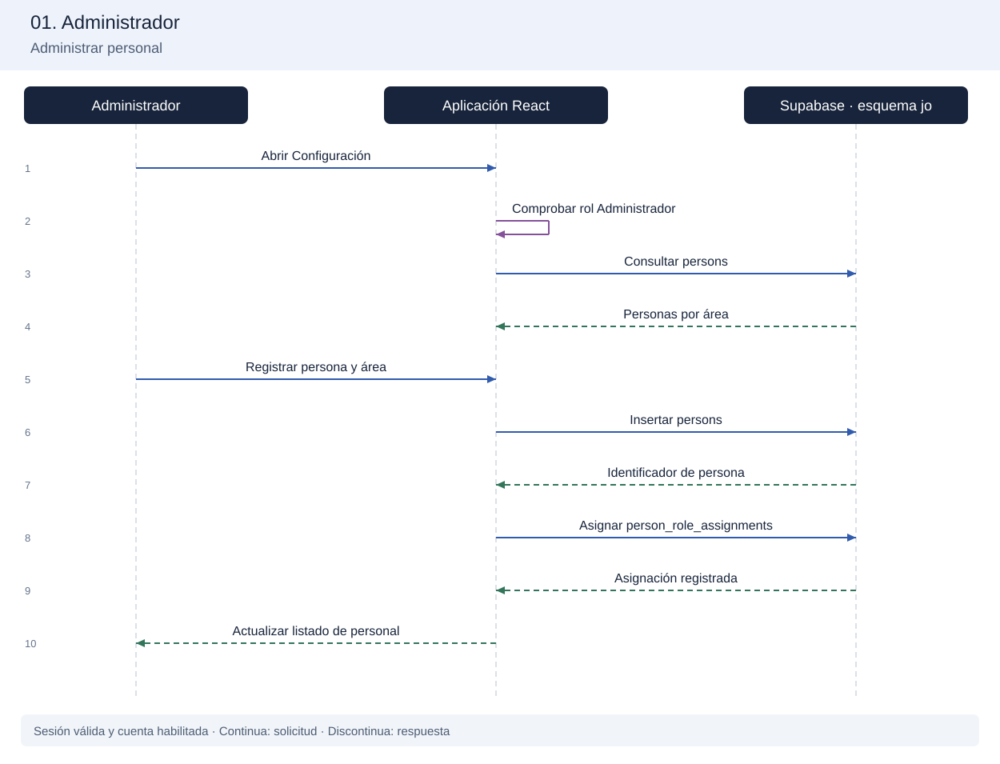

[Mermaid editable](./diagramas-roles/01-administrador.mmd) · [Imagen SVG](./diagramas-roles/01-administrador.svg)

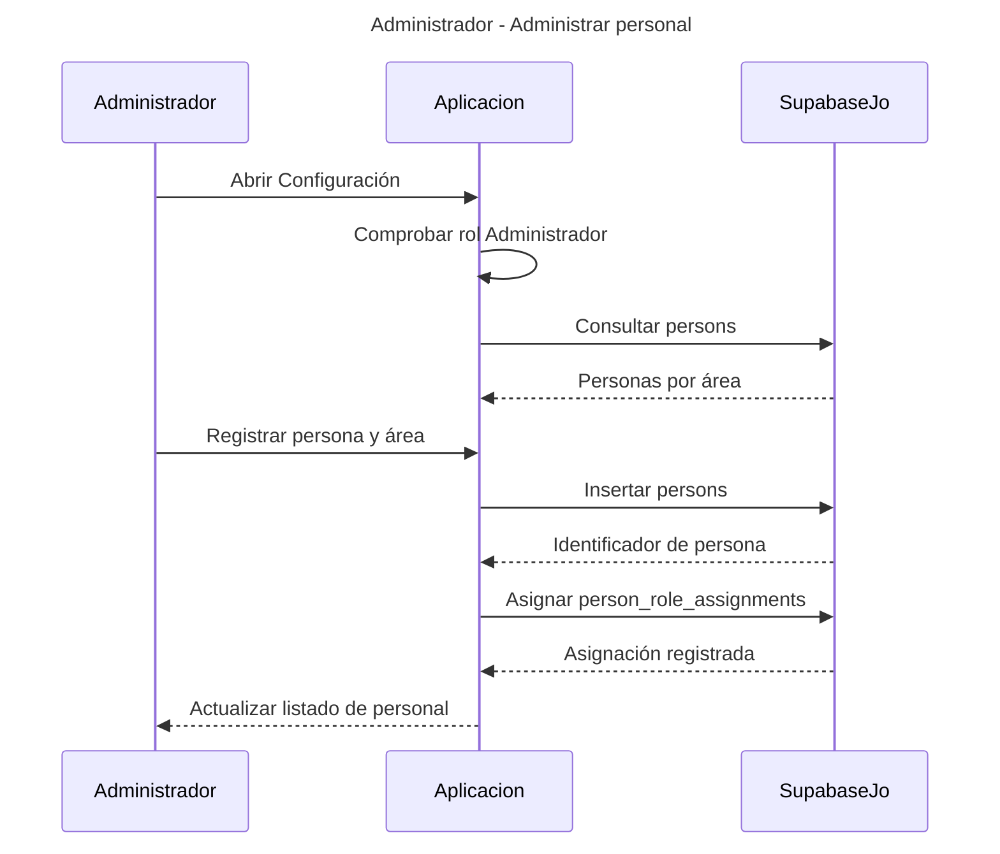
```mermaid
sequenceDiagram
    title Administrador - Administrar personal
    participant Administrador
    participant Aplicacion
    participant SupabaseJo
    Administrador->>Aplicacion: Abrir Configuración
    Aplicacion->>Aplicacion: Comprobar rol Administrador
    Aplicacion->>SupabaseJo: Consultar persons
    SupabaseJo-->>Aplicacion: Personas por área
    Administrador->>Aplicacion: Registrar persona y área
    Aplicacion->>SupabaseJo: Insertar persons
    SupabaseJo-->>Aplicacion: Identificador de persona
    Aplicacion->>SupabaseJo: Asignar person_role_assignments
    SupabaseJo-->>Aplicacion: Asignación registrada
    Aplicacion-->>Administrador: Actualizar listado de personal
```

## 2. Creador de Ficha

Registra la identidad y las características de las prendas, y controla su seguimiento.

**Pantallas:** /ficha-nueva, /referentes, /v2/sm/* y rutas comunes.

| ID | Caso de uso | Interacción y resultado |
|---|---|---|
| FIC-01 | Crear referencia y ficha inicial | Seleccionar colección y año; registrar número, nombre, color, línea, sublínea, tallaje y características de la prenda. |
| FIC-02 | Editar información general | Actualizar los campos habilitados en el detalle, incluido el estado general. |
| FIC-03 | Consultar referentes | Consultar el catálogo y consumos históricos para elegir un referente base. |
| FIC-04 | Vincular referente base | Asociar una referencia anterior como base de moldería durante la creación de la ficha. |
| FIC-05 | Operar máquina de estados | Consultar bandejas, alertas e historial; inicializar estados y ejecutar transiciones válidas. |

**Condiciones y alcance:** El número se valida dentro de colección + año. El diagrama muestra la creación sin referente opcional. La asignación oficial de códigos MD/PT y la administración de catálogos se reservan al Administrador.

**Secuencia representativa:** Crear una referencia.

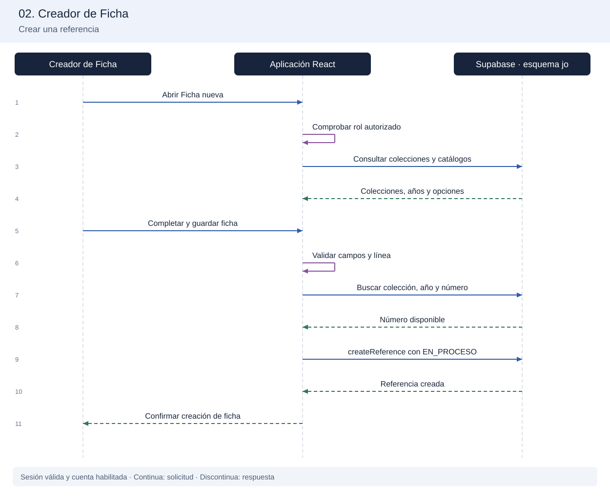

[Mermaid editable](./diagramas-roles/02-creador-de-ficha.mmd) · [Imagen SVG](./diagramas-roles/02-creador-de-ficha.svg)

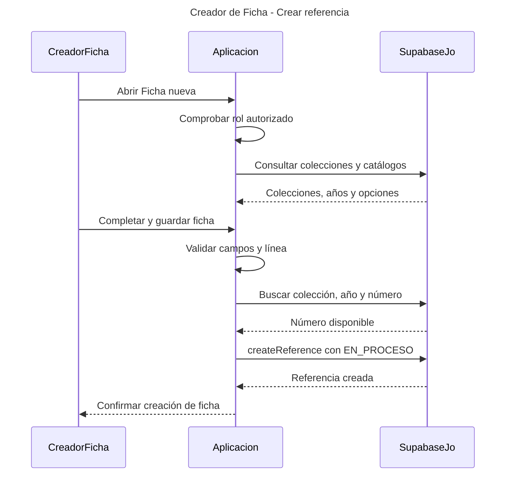
```mermaid
sequenceDiagram
    title Creador de Ficha - Crear referencia
    participant CreadorFicha
    participant Aplicacion
    participant SupabaseJo
    CreadorFicha->>Aplicacion: Abrir Ficha nueva
    Aplicacion->>Aplicacion: Comprobar rol autorizado
    Aplicacion->>SupabaseJo: Consultar colecciones y catálogos
    SupabaseJo-->>Aplicacion: Colecciones, años y opciones
    CreadorFicha->>Aplicacion: Completar y guardar ficha
    Aplicacion->>Aplicacion: Validar campos y línea
    Aplicacion->>SupabaseJo: Buscar colección, año y número
    SupabaseJo-->>Aplicacion: Número disponible
    Aplicacion->>SupabaseJo: createReference con EN_PROCESO
    SupabaseJo-->>Aplicacion: Referencia creada
    Aplicacion-->>CreadorFicha: Confirmar creación de ficha
```

## 3. Diseñador Creativo

Desarrolla la muestra y registra materiales, procesos y validaciones de diseño.

**Pantallas:** /creativo y rutas comunes, con acciones dentro del detalle de referencia.

| ID | Caso de uso | Interacción y resultado |
|---|---|---|
| CRE-01 | Consultar avance creativo | Buscar referencias y revisar progreso de laboratorio, corte, confección, insumos, telas, consumos y medición. |
| CRE-02 | Gestionar telas y consumos creativos | Asociar telas a la referencia, registrar consumos versionados y confirmar telas utilizadas. |
| CRE-03 | Gestionar insumos | Solicitar insumos a Bodega, cancelar solicitudes y confirmar insumos recibidos como utilizados; registrar consumos por talla. |
| CRE-04 | Registrar laboratorio y moldería | Crear y actualizar laboratorios y registrar información de moldería. |
| CRE-05 | Registrar corte y confección de muestra | Registrar cortes y confecciones de muestra desde el detalle de la referencia. |
| CRE-06 | Registrar medición de muestra | Guardar talla, medición, resultado de aprobación o rechazo y observaciones. |
| CRE-07 | Solicitar corte | Crear una solicitud para muestra, laboratorio, pieza u otro tipo habilitado. |
| CRE-08 | Entregar o devolver referencia | Entregar a Diseño Técnico cuando el área CREATIVO está IN_PROGRESS, o devolver con observaciones. |

**Condiciones y alcance:** El diagrama CRE-02 muestra una tela con valores de consumo que generan una nueva versión CREATIVO. Registrar una medición APROBADA con este rol no actualiza automáticamente el estado general: la interfaz indica que debe hacerlo Administrador o Creador de Ficha.

**Secuencia representativa:** Asignar tela y consumo creativo.

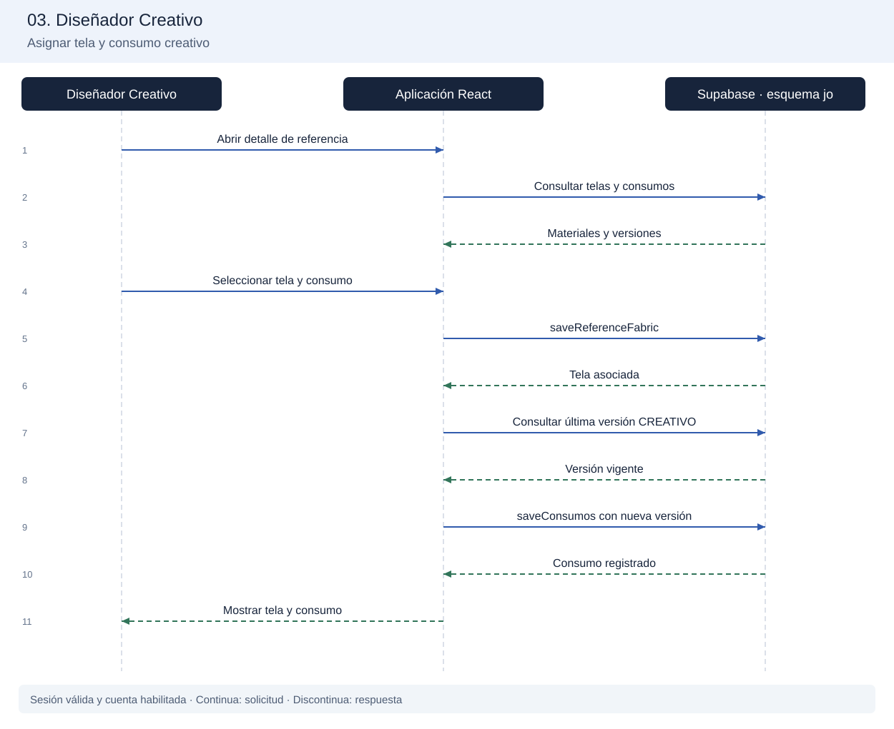

[Mermaid editable](./diagramas-roles/03-disenador-creativo.mmd) · [Imagen SVG](./diagramas-roles/03-disenador-creativo.svg)

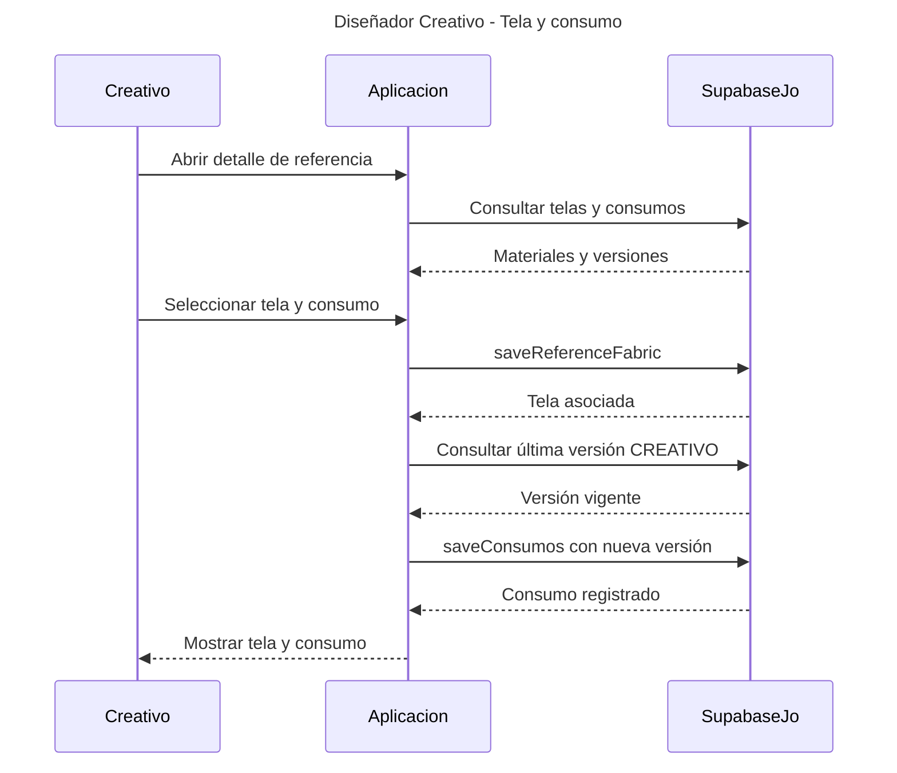
```mermaid
sequenceDiagram
    title Diseñador Creativo - Tela y consumo
    participant Creativo
    participant Aplicacion
    participant SupabaseJo
    Creativo->>Aplicacion: Abrir detalle de referencia
    Aplicacion->>SupabaseJo: Consultar telas y consumos
    SupabaseJo-->>Aplicacion: Materiales y versiones
    Creativo->>Aplicacion: Seleccionar tela y consumo
    Aplicacion->>SupabaseJo: saveReferenceFabric
    SupabaseJo-->>Aplicacion: Tela asociada
    Aplicacion->>SupabaseJo: Consultar última versión CREATIVO
    SupabaseJo-->>Aplicacion: Versión vigente
    Aplicacion->>SupabaseJo: saveConsumos con nueva versión
    SupabaseJo-->>Aplicacion: Consumo registrado
    Aplicacion-->>Creativo: Mostrar tela y consumo
```

## 4. Diseñador Técnico

Recibe el trabajo técnico y coordina su entrega hacia Trazador.

**Pantallas:** Rutas comunes; las acciones se habilitan en el detalle de referencia.

| ID | Caso de uso | Interacción y resultado |
|---|---|---|
| TEC-01 | Recibir referencia | Aceptar una entrega destinada a TECNICO y registrar recepción e inicio. |
| TEC-02 | Entregar a Trazador | Cerrar el trabajo técnico en curso y crear la siguiente entrega hacia TRAZADOR. |
| TEC-03 | Devolver con observaciones | Registrar una devolución al área anterior mediante el flujo de entregas. |
| TEC-04 | Solicitar corte | Enviar desde el detalle una solicitud de corte, por ejemplo de contramuestra. |
| TEC-05 | Solicitar insumos | Crear y cancelar solicitudes de insumos a Bodega. |
| TEC-06 | Consultar desarrollo | Revisar materiales, muestra, historial y ficha final de la referencia. |

**Condiciones y alcance:** La recepción exige área TECNICO en PENDING_RECEIPT; la entrega o devolución exige IN_PROGRESS. La entrega mediante deliver_reference_handoff cierra la fila actual y crea la siguiente en una transacción. La pantalla /produccion/consumos no permite el rol Diseñador Técnico, aunque la política de base de datos sí contempla consumos TECNICO. No se documenta la edición de esos consumos como un flujo completo disponible en la interfaz.

**Secuencia representativa:** Recibir y entregar una referencia.

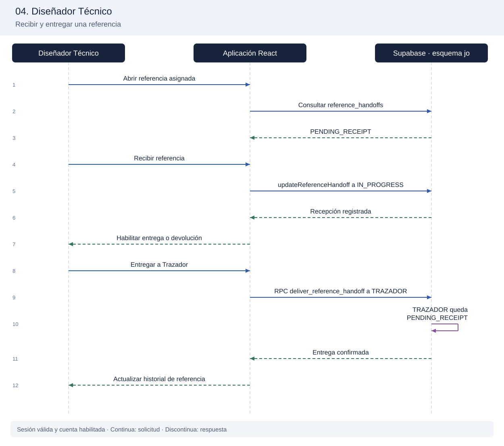

[Mermaid editable](./diagramas-roles/04-disenador-tecnico.mmd) · [Imagen SVG](./diagramas-roles/04-disenador-tecnico.svg)

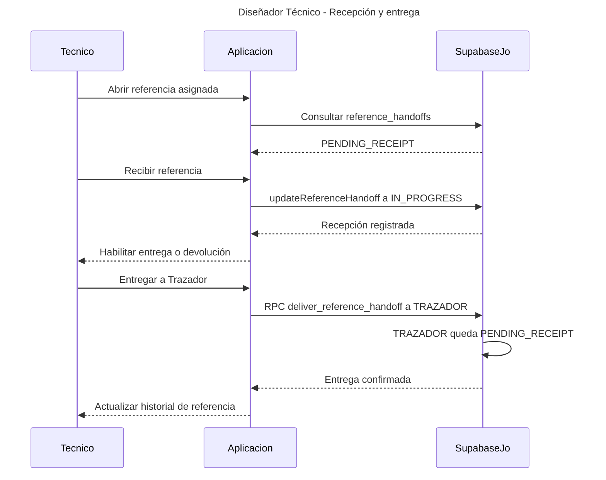
```mermaid
sequenceDiagram
    title Diseñador Técnico - Recepción y entrega
    participant Tecnico
    participant Aplicacion
    participant SupabaseJo
    Tecnico->>Aplicacion: Abrir referencia asignada
    Aplicacion->>SupabaseJo: Consultar reference_handoffs
    SupabaseJo-->>Aplicacion: PENDING_RECEIPT
    Tecnico->>Aplicacion: Recibir referencia
    Aplicacion->>SupabaseJo: updateReferenceHandoff a IN_PROGRESS
    SupabaseJo-->>Aplicacion: Recepción registrada
    Aplicacion-->>Tecnico: Habilitar entrega o devolución
    Tecnico->>Aplicacion: Entregar a Trazador
    Aplicacion->>SupabaseJo: RPC deliver_reference_handoff a TRAZADOR
    SupabaseJo->>SupabaseJo: TRAZADOR queda PENDING_RECEIPT
    SupabaseJo-->>Aplicacion: Entrega confirmada
    Aplicacion-->>Tecnico: Actualizar historial de referencia
```

## 5. Líder de Modistas

Coordina el avance de las órdenes de trabajo del taller.

**Pantallas:** /taller y rutas comunes.

| ID | Caso de uso | Interacción y resultado |
|---|---|---|
| MOD-01 | Consultar tablero de taller | Revisar órdenes por corte, confección, proceso externo y medición; filtrar por estado y consultar indicadores. |
| MOD-02 | Crear orden de trabajo | Registrar prenda, colección, referencia opcional, etapa, prioridad y observaciones. |
| MOD-03 | Iniciar orden | Cambiar una orden pendiente a active. |
| MOD-04 | Avanzar o cerrar orden | Mover una orden activa a la siguiente etapa; completar la orden al terminar la última etapa. |
| MOD-05 | Solicitar insumos | Solicitar y cancelar solicitudes de insumos en el detalle de referencia. |

**Condiciones y alcance:** El diagrama MOD-03/MOD-04 parte de una orden existente. El tablero distingue etapas y estados. Las políticas permiten también escrituras de contramuestras y consumos CONTRAMUESTRA para este rol, pero /produccion/ficha-final y /produccion/consumos no están habilitadas para él; esos permisos de base de datos no equivalen a pantallas accesibles.

**Secuencia representativa:** Avanzar una orden de taller.

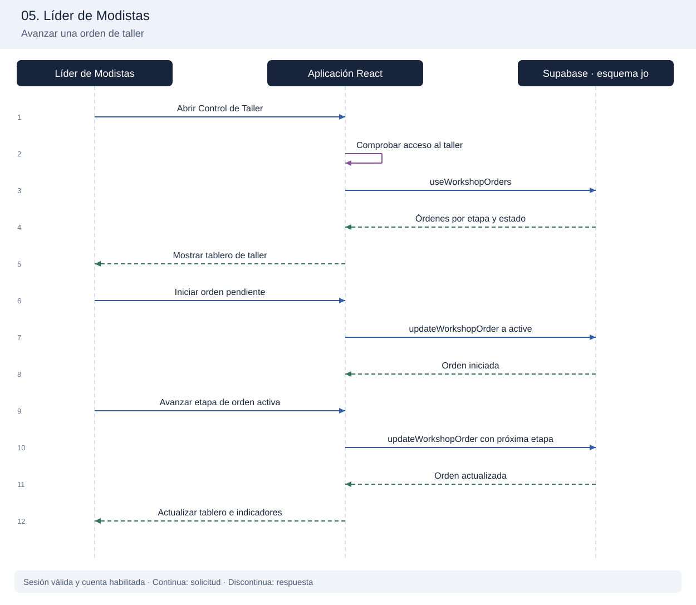

[Mermaid editable](./diagramas-roles/05-lider-de-modistas.mmd) · [Imagen SVG](./diagramas-roles/05-lider-de-modistas.svg)

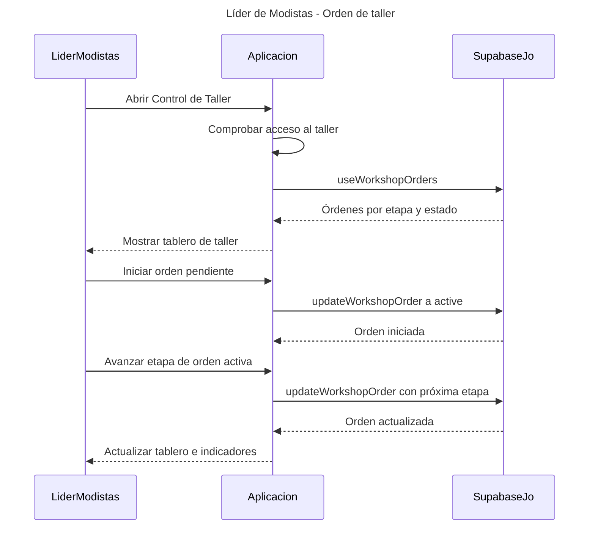
```mermaid
sequenceDiagram
    title Líder de Modistas - Orden de taller
    participant LiderModistas
    participant Aplicacion
    participant SupabaseJo
    LiderModistas->>Aplicacion: Abrir Control de Taller
    Aplicacion->>Aplicacion: Comprobar acceso al taller
    Aplicacion->>SupabaseJo: useWorkshopOrders
    SupabaseJo-->>Aplicacion: Órdenes por etapa y estado
    Aplicacion-->>LiderModistas: Mostrar tablero de taller
    LiderModistas->>Aplicacion: Iniciar orden pendiente
    Aplicacion->>SupabaseJo: updateWorkshopOrder a active
    SupabaseJo-->>Aplicacion: Orden iniciada
    LiderModistas->>Aplicacion: Avanzar etapa de orden activa
    Aplicacion->>SupabaseJo: updateWorkshopOrder con próxima etapa
    SupabaseJo-->>Aplicacion: Orden actualizada
    Aplicacion-->>LiderModistas: Actualizar tablero e indicadores
```

## 6. Trazador

Registra trazos, analiza opciones y mantiene los consumos de trazado.

**Pantallas:** /trazador, /trazador/comparativo/:refId, /produccion/consumos y rutas comunes.

| ID | Caso de uso | Interacción y resultado |
|---|---|---|
| TRA-01 | Recibir referencia | Aceptar una entrega destinada a TRAZADOR desde el detalle de referencia. |
| TRA-02 | Consultar trazos | Buscar referencias y revisar sus telas y trazos por fase. |
| TRA-03 | Crear, editar o eliminar trazo | Registrar fase de costeo o contramuestra, opción, piezas, tallas, anchos, consumo, fechas y datos del archivo Audaces. |
| TRA-04 | Comparar opciones | Comparar trazos y registrar las opciones seleccionadas en el comparativo. |
| TRA-05 | Registrar consumos de Trazador | Guardar consumos versionados del área TRAZADOR y consultar sus versiones. |

**Condiciones y alcance:** El diagrama TRA-03 representa un nuevo trazo. El rol de las escrituras de consumo debe ser TRAZADOR. Audaces aparece como información registrada; el diagrama no presupone una integración automática con ese software.

**Secuencia representativa:** Registrar un trazo.

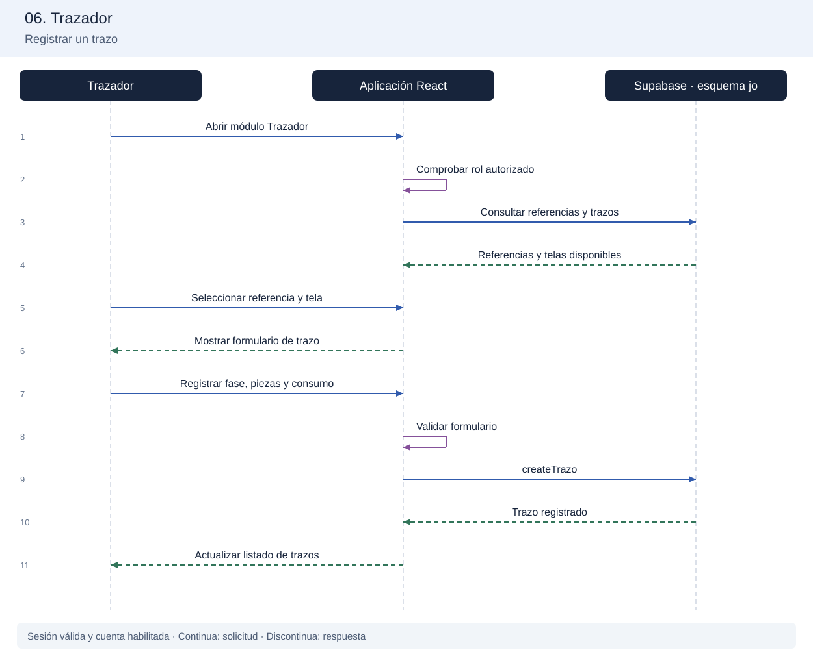

[Mermaid editable](./diagramas-roles/06-trazador.mmd) · [Imagen SVG](./diagramas-roles/06-trazador.svg)

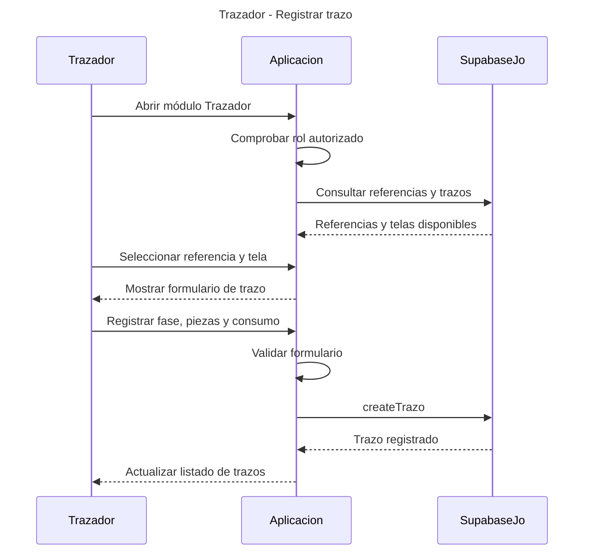
```mermaid
sequenceDiagram
    title Trazador - Registrar trazo
    participant Trazador
    participant Aplicacion
    participant SupabaseJo
    Trazador->>Aplicacion: Abrir módulo Trazador
    Aplicacion->>Aplicacion: Comprobar rol autorizado
    Aplicacion->>SupabaseJo: Consultar referencias y trazos
    SupabaseJo-->>Aplicacion: Referencias y telas disponibles
    Trazador->>Aplicacion: Seleccionar referencia y tela
    Aplicacion-->>Trazador: Mostrar formulario de trazo
    Trazador->>Aplicacion: Registrar fase, piezas y consumo
    Aplicacion->>Aplicacion: Validar formulario
    Aplicacion->>SupabaseJo: createTrazo
    SupabaseJo-->>Aplicacion: Trazo registrado
    Aplicacion-->>Trazador: Actualizar listado de trazos
```

## 7. Especificadora

Consolida la composición, los cuidados y los datos finales de la prenda.

**Pantallas:** /produccion/ficha-final y rutas comunes.

| ID | Caso de uso | Interacción y resultado |
|---|---|---|
| ESP-01 | Consultar ficha final | Seleccionar colección, año y referencia para revisar la ficha completa. |
| ESP-02 | Gestionar composición | Registrar materiales y porcentajes para muestra y producción. |
| ESP-03 | Gestionar cuidados | Registrar las instrucciones de cuidado asociadas a la referencia. |
| ESP-04 | Gestionar contramuestras | Registrar OT, estado, fechas, color, talla, cantidades y observaciones. |
| ESP-05 | Registrar notas de fabricación | Registrar datos de notas de fabricación SAP asociados a contramuestras. |
| ESP-06 | Registrar novedades de calidad | Registrar hallazgos, clasificación, acciones correctivas y resolución. |
| ESP-07 | Guardar ficha final | Validar y persistir los cambios relacionados mediante save_final_sheet. |

**Condiciones y alcance:** Las contramuestras pendientes, activas o utilizadas requieren código de OT. El guardado se hace mediante una transacción que se ejecuta con los permisos del usuario. Los datos SAP son registrados en la aplicación; este flujo no implica un intercambio automático con SAP.

**Secuencia representativa:** Guardar la ficha final.

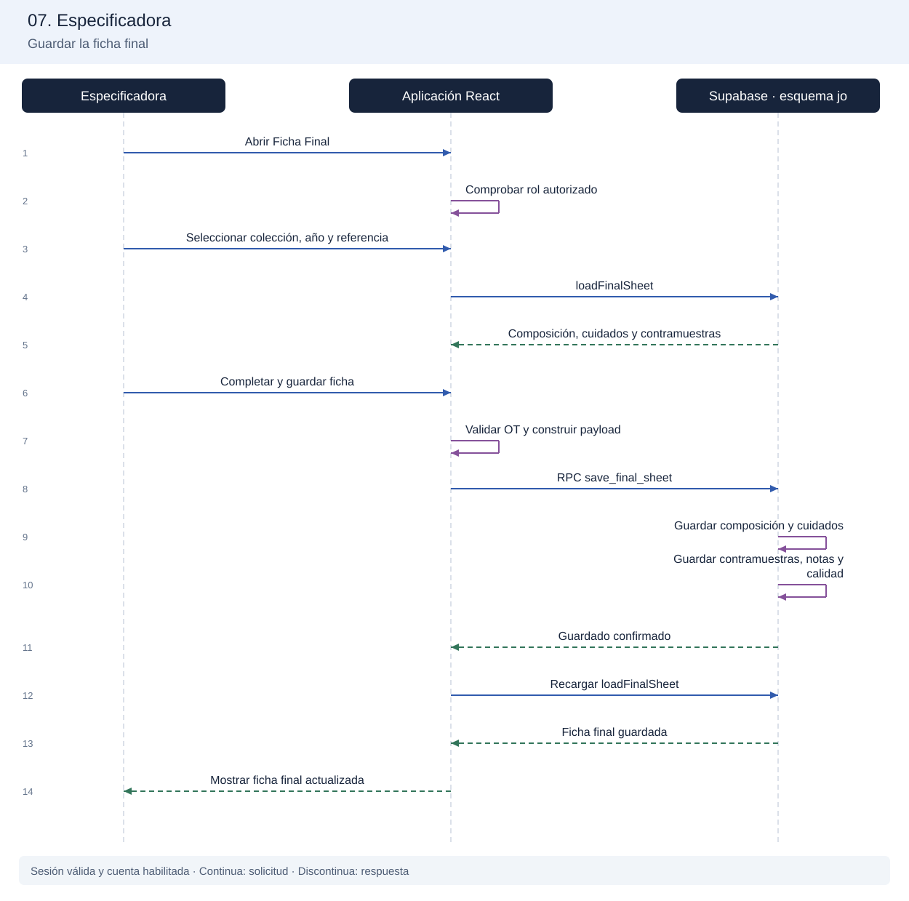

[Mermaid editable](./diagramas-roles/07-especificadora.mmd) · [Imagen SVG](./diagramas-roles/07-especificadora.svg)

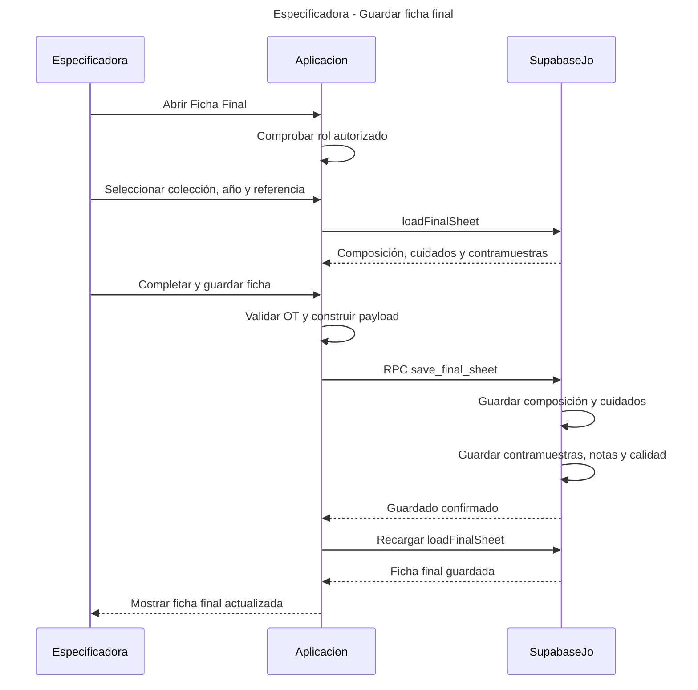
```mermaid
sequenceDiagram
    title Especificadora - Guardar ficha final
    participant Especificadora
    participant Aplicacion
    participant SupabaseJo
    Especificadora->>Aplicacion: Abrir Ficha Final
    Aplicacion->>Aplicacion: Comprobar rol autorizado
    Especificadora->>Aplicacion: Seleccionar colección, año y referencia
    Aplicacion->>SupabaseJo: loadFinalSheet
    SupabaseJo-->>Aplicacion: Composición, cuidados y contramuestras
    Especificadora->>Aplicacion: Completar y guardar ficha
    Aplicacion->>Aplicacion: Validar OT y construir payload
    Aplicacion->>SupabaseJo: RPC save_final_sheet
    SupabaseJo->>SupabaseJo: Guardar composición y cuidados
    SupabaseJo->>SupabaseJo: Guardar contramuestras, notas y calidad
    SupabaseJo-->>Aplicacion: Guardado confirmado
    Aplicacion->>SupabaseJo: Recargar loadFinalSheet
    SupabaseJo-->>Aplicacion: Ficha final guardada
    Aplicacion-->>Especificadora: Mostrar ficha final actualizada
```

## 8. Cortador

Ejecuta y registra el trabajo de corte.

**Pantallas:** /taller/corte, /importar/corte, /informes/corte y rutas comunes.

| ID | Caso de uso | Interacción y resultado |
|---|---|---|
| COR-01 | Consultar cola de corte | Filtrar solicitudes por colección o cortador y consultar solicitudes archivadas. |
| COR-02 | Crear solicitud manual | Registrar referencia, colección, tipo, manejo de tela, solicitante, cortadores, fechas y observaciones. |
| COR-03 | Asignar e iniciar corte | Seleccionar uno o varios cortadores y cambiar la solicitud a en_corte. |
| COR-04 | Completar y entregar corte | Registrar cortado con fecha de entrega y después el estado entregado. |
| COR-05 | Gestionar historial | Reencolar, archivar y desarchivar solicitudes. |
| COR-06 | Importar datos de corte | Cargar CSV; la pantalla también ofrece sincronización de entrada desde Google Sheets mediante una función Supabase. |
| COR-07 | Consultar y exportar informe | Consultar informes de corte y exportar sus detalles a CSV. |

**Condiciones y alcance:** El diagrama COR-03/COR-04 recorre en_cola, en_corte, cortado y entregado. El trabajo físico de preparar, fusionar y cortar telas sucede fuera de la aplicación. La disponibilidad real de la sincronización Google Sheets depende de la función y su configuración desplegada.

**Secuencia representativa:** Procesar una solicitud de corte.

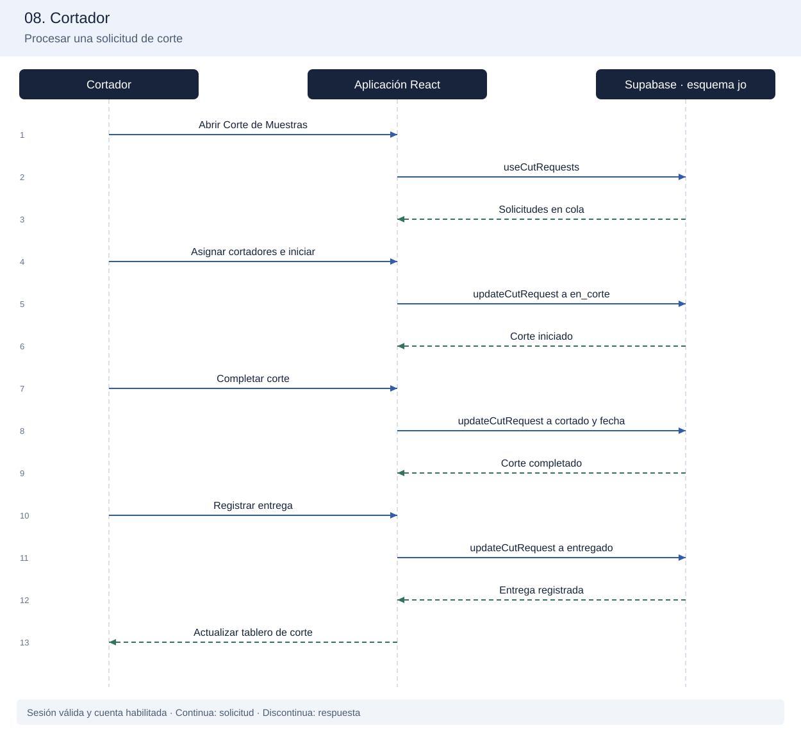

[Mermaid editable](./diagramas-roles/08-cortador.mmd) · [Imagen SVG](./diagramas-roles/08-cortador.svg)

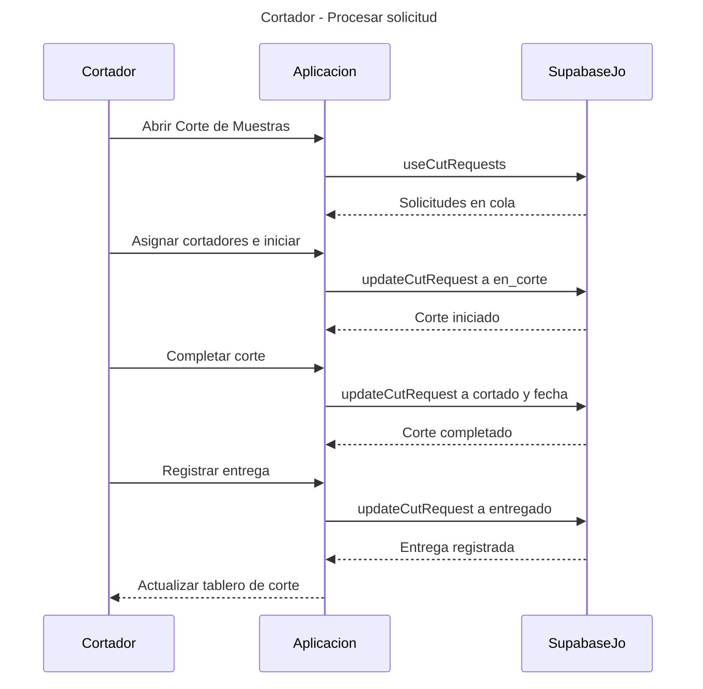
```mermaid
sequenceDiagram
    title Cortador - Procesar solicitud
    participant Cortador
    participant Aplicacion
    participant SupabaseJo
    Cortador->>Aplicacion: Abrir Corte de Muestras
    Aplicacion->>SupabaseJo: useCutRequests
    SupabaseJo-->>Aplicacion: Solicitudes en cola
    Cortador->>Aplicacion: Asignar cortadores e iniciar
    Aplicacion->>SupabaseJo: updateCutRequest a en_corte
    SupabaseJo-->>Aplicacion: Corte iniciado
    Cortador->>Aplicacion: Completar corte
    Aplicacion->>SupabaseJo: updateCutRequest a cortado y fecha
    SupabaseJo-->>Aplicacion: Corte completado
    Cortador->>Aplicacion: Registrar entrega
    Aplicacion->>SupabaseJo: updateCutRequest a entregado
    SupabaseJo-->>Aplicacion: Entrega registrada
    Aplicacion-->>Cortador: Actualizar tablero de corte
```

## 9. Líder de Cortadores

Coordina solicitudes y asignaciones del equipo de corte.

**Pantallas:** /taller/corte, /importar/corte, /informes/corte y rutas comunes.

| ID | Caso de uso | Interacción y resultado |
|---|---|---|
| LCO-01 | Supervisar cola de corte | Revisar solicitudes y filtrar por colección o cortador. |
| LCO-02 | Registrar solicitudes | Crear solicitudes manuales con sus datos y observaciones. |
| LCO-03 | Asignar cortadores | Seleccionar el equipo responsable e iniciar el corte. |
| LCO-04 | Supervisar avances y entregas | Registrar estados de corte y consultar el historial. |
| LCO-05 | Gestionar historial | Reencolar, archivar o desarchivar solicitudes. |
| LCO-06 | Importar solicitudes | Usar la importación CSV o la sincronización de entrada disponible en la pantalla. |
| LCO-07 | Consultar y exportar informes | Consultar el informe de corte y exportar detalles a CSV. |

**Condiciones y alcance:** Actualmente tiene los mismos permisos de rutas y de cut_requests que Cortador. La diferencia es organizativa. La documentación del oficio menciona definir prioridades, pero el tablero de corte no implementa un permiso exclusivo del líder ni un flujo específico de priorización; no se agrega esa función al diagrama.

**Secuencia representativa:** Asignar solicitudes de corte.

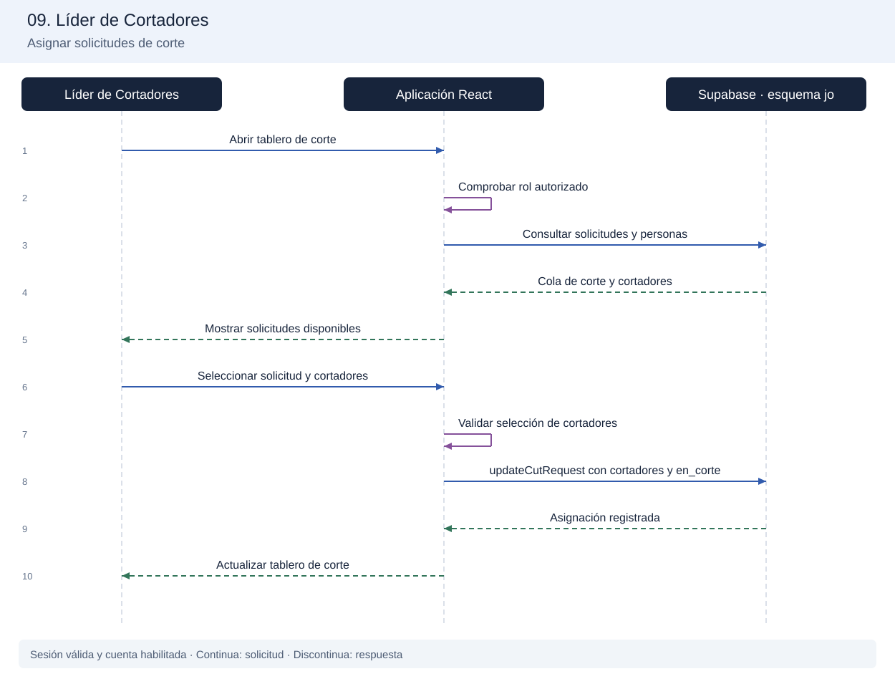

[Mermaid editable](./diagramas-roles/09-lider-de-cortadores.mmd) · [Imagen SVG](./diagramas-roles/09-lider-de-cortadores.svg)

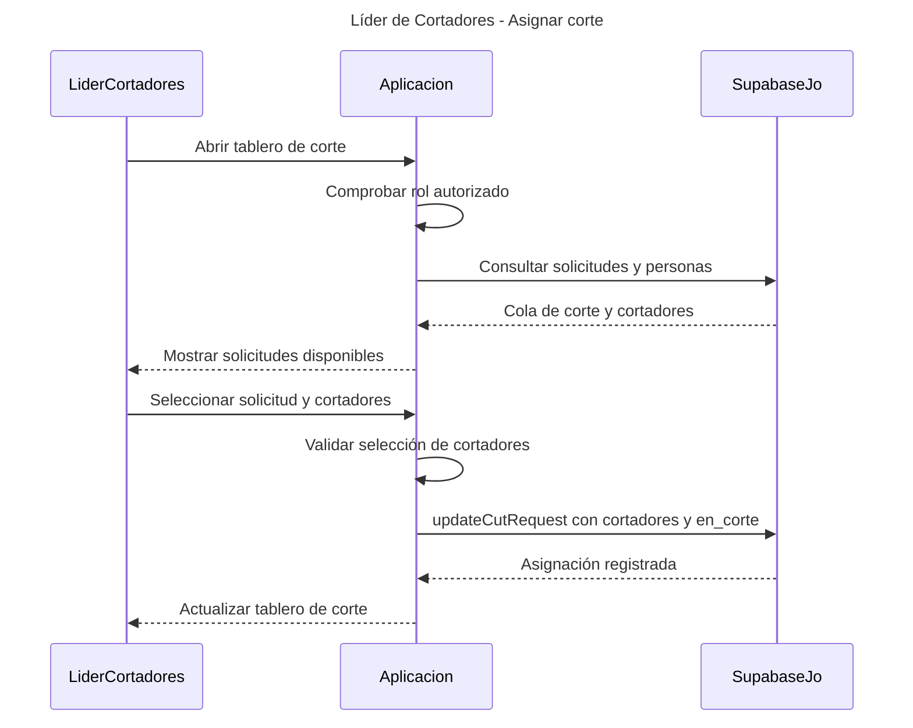
```mermaid
sequenceDiagram
    title Líder de Cortadores - Asignar corte
    participant LiderCortadores
    participant Aplicacion
    participant SupabaseJo
    LiderCortadores->>Aplicacion: Abrir tablero de corte
    Aplicacion->>Aplicacion: Comprobar rol autorizado
    Aplicacion->>SupabaseJo: Consultar solicitudes y personas
    SupabaseJo-->>Aplicacion: Cola de corte y cortadores
    Aplicacion-->>LiderCortadores: Mostrar solicitudes disponibles
    LiderCortadores->>Aplicacion: Seleccionar solicitud y cortadores
    Aplicacion->>Aplicacion: Validar selección de cortadores
    Aplicacion->>SupabaseJo: updateCutRequest con cortadores y en_corte
    SupabaseJo-->>Aplicacion: Asignación registrada
    Aplicacion-->>LiderCortadores: Actualizar tablero de corte
```

## 10. Bodega

Atiende solicitudes de insumos y registra las entregas.

**Pantallas:** Rutas comunes; sección Insumos Bodega dentro del detalle de referencia.

| ID | Caso de uso | Interacción y resultado |
|---|---|---|
| BOD-01 | Consultar solicitudes | Revisar las solicitudes de insumos asociadas a una referencia. |
| BOD-02 | Registrar entrega | Guardar código entregado, cantidad, responsable, fecha y observaciones; cambiar la solicitud a ENTREGADO. |
| BOD-03 | Consultar trazabilidad | Revisar cantidades solicitadas y entregadas y estado de las solicitudes. |

**Condiciones y alcance:** No existe una ruta independiente /bodega. En la interfaz, Bodega entrega insumos; la confirmación de que se usaron corresponde a Diseñador Creativo o Administrador. La política de UPDATE de supply_requests permite más roles que el botón de entrega; la distinción indicada aquí corresponde al flujo presentado por la interfaz.

**Secuencia representativa:** Registrar una entrega de insumos.

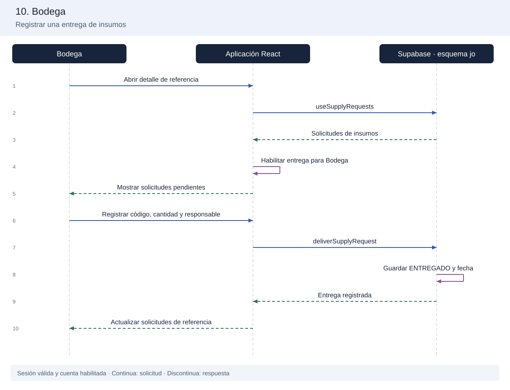

[Mermaid editable](./diagramas-roles/10-bodega.mmd) · [Imagen SVG](./diagramas-roles/10-bodega.svg)

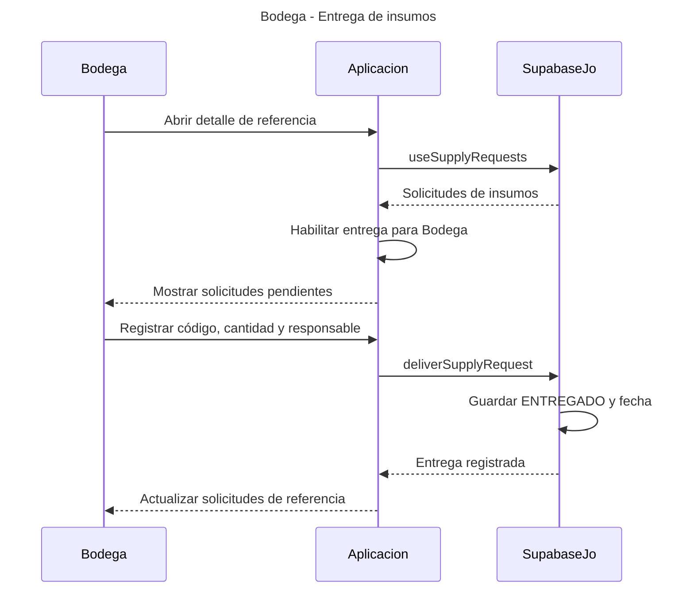
```mermaid
sequenceDiagram
    title Bodega - Entrega de insumos
    participant Bodega
    participant Aplicacion
    participant SupabaseJo
    Bodega->>Aplicacion: Abrir detalle de referencia
    Aplicacion->>SupabaseJo: useSupplyRequests
    SupabaseJo-->>Aplicacion: Solicitudes de insumos
    Aplicacion->>Aplicacion: Habilitar entrega para Bodega
    Aplicacion-->>Bodega: Mostrar solicitudes pendientes
    Bodega->>Aplicacion: Registrar código, cantidad y responsable
    Aplicacion->>SupabaseJo: deliverSupplyRequest
    SupabaseJo->>SupabaseJo: Guardar ENTREGADO y fecha
    SupabaseJo-->>Aplicacion: Entrega registrada
    Aplicacion-->>Bodega: Actualizar solicitudes de referencia
```

## 11. Visitante

Consulta información de la aplicación con una cuenta habilitada.

**Pantallas:** / y /colecciones con sus rutas de año y detalle.

| ID | Caso de uso | Interacción y resultado |
|---|---|---|
| VIS-01 | Consultar Dashboard | Ver indicadores y avance general de colecciones. |
| VIS-02 | Explorar colecciones | Navegar por colección y año, buscar y filtrar referencias. |
| VIS-03 | Consultar referencia | Revisar información general, materiales, procesos, historial y secciones de ficha final disponibles en el detalle. |

**Condiciones y alcance:** Visitante es un rol autenticado. Sin sesión se muestra el login; no se habilita acceso público al negocio. Las políticas del repositorio permiten consulta con cuenta activa y no conceden escrituras funcionales al rol Visitante.

**Secuencia representativa:** Consultar una referencia.

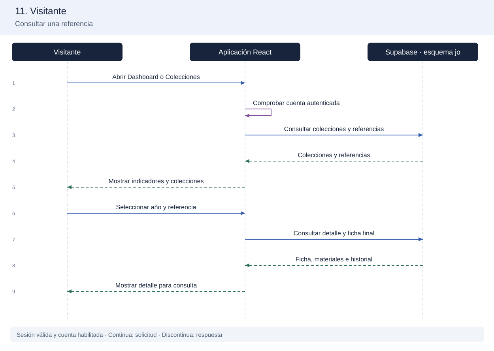

[Mermaid editable](./diagramas-roles/11-visitante.mmd) · [Imagen SVG](./diagramas-roles/11-visitante.svg)

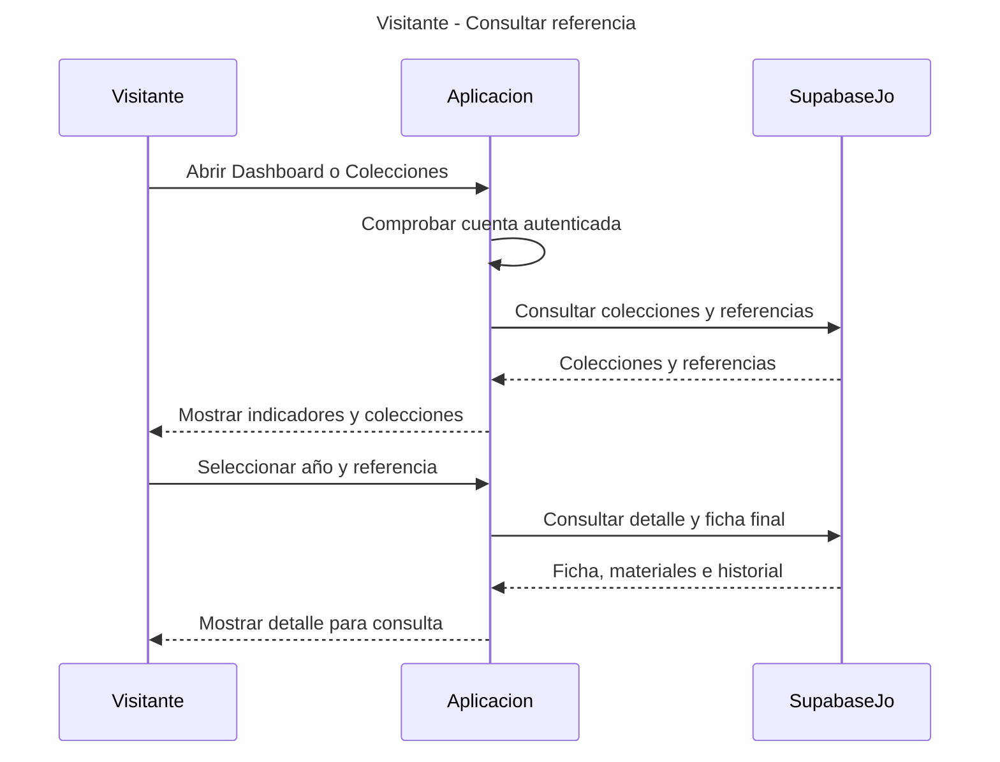
```mermaid
sequenceDiagram
    title Visitante - Consultar referencia
    participant Visitante
    participant Aplicacion
    participant SupabaseJo
    Visitante->>Aplicacion: Abrir Dashboard o Colecciones
    Aplicacion->>Aplicacion: Comprobar cuenta autenticada
    Aplicacion->>SupabaseJo: Consultar colecciones y referencias
    SupabaseJo-->>Aplicacion: Colecciones y referencias
    Aplicacion-->>Visitante: Mostrar indicadores y colecciones
    Visitante->>Aplicacion: Seleccionar año y referencia
    Aplicacion->>SupabaseJo: Consultar detalle y ficha final
    SupabaseJo-->>Aplicacion: Ficha, materiales e historial
    Aplicacion-->>Visitante: Mostrar detalle para consulta
```

## Diferencias entre intención del negocio y funciones implementadas

- **Cortador y Líder de Cortadores:** comparten permisos efectivos. Sus responsabilidades de negocio son distintas, pero no hay una restricción exclusiva del líder en el tablero actual.
- **Diseñador Técnico:** opera recepciones, entregas, solicitudes de corte e insumos desde el detalle. Tiene permisos SQL sobre consumos técnicos, pero su rol no entra a la pantalla dedicada de consumos.
- **Líder de Modistas:** dispone del tablero de taller. Los permisos SQL adicionales para contramuestras no le abren la pantalla de Ficha Final.
- **Bodega:** registra entregas desde el detalle. El catálogo administrativo de insumos está reservado al Administrador.
- **Oficios del personal:** modistas, bordadoras y otros oficios registrados no constituyen cuentas de acceso independientes. Una persona necesita uno de los 11 roles válidos en user_accounts para entrar.
- **Operaciones externas:** preparar tela, cortar físicamente, fusionar y trabajar en Audaces son tareas del oficio. Los diagramas no las representan como llamadas de software. Los datos de SAP se registran en fichas; no se presupone una integración SAP.
- **Permisos de botones y base de datos:** son capas distintas. El documento describe los flujos visibles con autorización en las migraciones; un botón mostrado por sí solo no prueba que una escritura esté autorizada.

## Fuentes revisadas

- [Roles y validación de cuenta](../src/context/AuthContext.jsx), [permisos de rutas](../src/lib/permissions.js), [rutas](../src/App.jsx) y [protección de rutas](../src/components/ProtectedRoute.jsx).
- [Permisos RLS/RBAC](../migracion/023_rbac_policies.sql) y [órdenes de taller y entregas entre áreas](../migracion/024_taller_workflow.sql).
- [Configuración de personas](../src/pages/ConfiguracionPersonas.jsx) y [guía de usuarios](../src/pages/GuiaCrearUsuario.jsx).
- [Creación de ficha](../src/pages/FichaTecnicaForm.jsx), [referentes](../src/pages/ReferentesView.jsx) y [detalle de referencia](../src/pages/ReferenciaDetalle.jsx).
- [Panel creativo](../src/pages/PanelCreativo.jsx), [telas y consumos](../src/components/AsignacionTelasConsumos.jsx), [medición](../src/components/MedicionMuestra.jsx), [laboratorios y moldería](../src/components/LaboratoriosMolderia.jsx) y [corte y confección de muestra](../src/components/CorteConfeccionMuestra.jsx).
- [Insumos y entregas](../src/components/InsumosBodega.jsx).
- [Taller](../src/pages/TallerKanban.jsx), [corte](../src/pages/CorteKanban.jsx), [importación de corte](../src/pages/ImportarCorteCSV.jsx) e [informes de corte](../src/pages/InformesCorte.jsx).
- [Trazador](../src/pages/TrazadorView.jsx), [formulario de trazo](../src/components/TrazoForm.jsx), [comparativo](../src/pages/ComparativoTrazos.jsx) y [consumos](../src/pages/ConsumosView.jsx).
- [Ficha final](../src/pages/FichaFinalView.jsx), [funciones de datos](../src/lib/api.js) y [transacción de ficha final](../migracion/021_ficha_final.sql).
- [Servicio de transiciones](../src/state-machine/services/transitionService.js).
- [Responsabilidades del Cortador](../rolesJO/cortador.md) y [del Líder de Cortadores](../rolesJO/lider_cortador.md), usadas para distinguir tareas del oficio y funciones del software.
