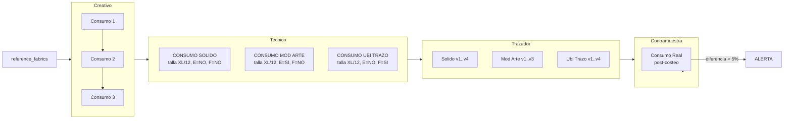
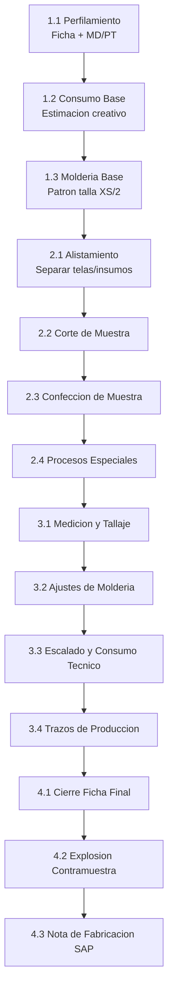

# Modelo Entidad-Relacion — Gestión de Colecciones JO

**Versión**: 2.0 | **Schema**: `jo` | **Motor**: PostgreSQL (Supabase)

---

## Diagrama ER Principal

```mermaid
erDiagram
    collections ||--o{ references : "coleccion_id"
    lines ||--o{ sublines : "line_id"
    lines ||--o{ references : "line_id"
    sublines ||--o{ references : "subline_id"
    tallaje_groups ||--o{ references : "tallaje_group_id"
    reference_statuses ||--o{ references : "status_id"
    workshop_statuses ||--o{ references : "workshop_status_id"
    closure_types ||--o{ references : "closure_type_id"
    empaques ||--o{ references : "package_type_id"
    tejido_types ||--o{ references : "tejido_type_id"
    difficulty_levels ||--o{ references : "complejidad_corte_id"
    difficulty_levels ||--o{ references : "complejidad_confeccion_id"
    difficulty_levels ||--o{ references : "dificultad_prenda_id"
    difficulty_levels ||--o{ references : "dificultad_bordado_id"

    references ||--o{ reference_codes : ""
    references ||--o{ references_variants : ""
    references ||--o{ references_referents : ""
    references ||--o{ reference_fabrics : ""
    references ||--o{ reference_supplies : ""
    references ||--o{ reference_includes : ""
    references ||--o{ consumos : ""
    references ||--o{ notas_fabricacion : ""
    references ||--o{ contramuestras : ""
    references ||--o{ molderia : ""
    references ||--o{ laboratorios : ""
    references ||--o{ entregables : ""

    fabrics ||--o{ reference_fabrics : ""
    supplies ||--o{ reference_supplies : ""
    fabric_base_types ||--o{ fabrics : ""

    reference_fabrics ||--o{ consumos : "reference_fabric_id"

    persons ||--o{ reference_assignments : ""
    persons ||--o{ reference_phase_history : ""
    persons ||--o{ sewings : "seamstress_id"
    persons ||--o{ contramuestras : "modista_id"
    persons ||--o{ consumos : "disenador_id"
    persons ||--o{ consumos : "registrado_por"
    persons ||--o{ molderia : "disenador_id"
    persons ||--o{ tech_sheets : "specialist_id"
    person_roles ||--o{ reference_assignments : "role_id"

    workflow_phases ||--o{ reference_assignments : "phase_id"
    workflow_phases ||--o{ reference_phase_history : "phase_id"
    references ||--o{ reference_assignments : ""
    references ||--o{ reference_phase_history : ""

    references ||--o{ reference_embroidery : ""
    references ||--o{ reference_semielaborated : ""
    references ||--o{ external_processes : ""
    references ||--o{ production_units : ""
    references ||--o{ quality_issues : ""
    references ||--o{ tech_sheets : ""
    references ||--o{ measures : ""
    references ||--o{ compositions : ""
    references ||--o{ care_instructions : ""
    references ||--o{ montage_mannequin : ""
    references ||--o{ cuts : ""
    references ||--o{ sewings : ""
    references ||--o{ embroidery_reviews : ""
    references ||--o{ production_feedback : ""

    process_types ||--o{ external_processes : "process_type_id"
    nota_fabricacion_statuses ||--o{ notas_fabricacion : "status_id"
    notas_fabricacion ||--o{ contramuestras : "nota_fabricacion_id"
    care_types ||--o{ care_instructions : "care_type_id"
    include_types ||--o{ reference_includes : ""
    include_types ||--o{ references : "include_type_id"
    variant_types ||--o{ references_variants : "variant_type_id"
```

---

## Flujo de Consumos (Versionado)

---

## Ciclo de Vida de una Referencia (Workflow)

---

## Convenciones

| Simbolo | Significado |
|---------|-------------|
| `||--o{` | Relacion 1:N |
| `}` | Cardinalidad muchos |

## Indices creados

Todas las FK tienen indices automaticos para optimizar JOINs. 28 indices adicionales para consultas frecuentes:

- `colecciones(active)` — filtrar colecciones activas
- `references(drop_entrega)` — agrupar por drops
- `references(created_at)` — ordenar por fecha
- `consumos(es_final) WHERE es_final = TRUE` — consultar solo definitivos
- `consumos(role)` — filtrar por area
- `production_feedback(feedback_type)` — agrupar por tipo

## Triggers y Validaciones

| Disparador | Funcion |
|------------|---------|
| `update_timestamp` en 6 tablas | Actualiza `updated_at = NOW()` en cada UPDATE |
| `validar_unico_es_final` en `consumos` | Al marcar `es_final=TRUE`, desmarca automaticamente todos los demas de la misma referencia+tela+rol+tipo |

---

## Archivos del Modelo

| Archivo | Contenido |
|---------|-----------|
| `database_schema.sql` | DDL completo (53 tablas, enums, indices, triggers, comentarios) |
| `migracion/seed_catalogos.sql` | Datos maestros (colecciones, lineas, status, telas, personas = 53 registros) |
| `migracion/seed_fases_workflow.sql` | 13 fases del workflow (1.1 a 4.3) con macro-fases |
| `migracion/ER_DIAGRAM.md` | Este documento |
