# PLAN DE MEJORA: REESTRUCTURACIÓN DEL SISTEMA DE GESTIÓN DE COLECCIONES JO

**Fecha del Plan:** 26 de enero de 2026  
**Versión:** 2.0 (Actualizada con clarificaciones del negocio)  
**Elaborado por:** Ingeniero Industrial - Especialista en Procesos de Manufactura Textil  

---

## 1. RESUMEN EJECUTIVO

Este plan de mejora propone una reestructuración completa del sistema de gestión de colecciones actuales (actualmente en archivo Excel "PROTOTIPO V.01") hacia un modelo de datos normalizado, eliminando redundancias, organizando la información en tablas relacionadas y preparando la estructura para integración nativa con herramientas de Business Intelligence como PowerBI y LockerStudio.

### Beneficios Esperados:
- **Reducción del 70% en volumen de datos** mediante eliminación de redundancias
- **Mejora en la velocidad de análisis** al tener datos normalizados
- **Integración directa con BI** sin necesidad de transformaciones complejas
- **Trazabilidad completa** del ciclo de vida de cada referencia
- **Escalabilidad** para futuras colecciones y cápsulas
- **Mantenimiento simplificado** de la información

---

## 2. ANÁLISIS DE LA ESTRUCTURA ACTUAL

### 2.1 Estado Actual del Archivo

| Aspecto | Situación Actual | Impacto |
|---------|-----------------|---------|
| **Número de columnas** | 106 columnas (A-HD) | Archivo inmantenible |
| **Hojas** | 2 (MATRIZ, PARAMETROS) | Mezcla de datos estáticos y dinámicos |
| **Redundancia detectada** | 15+ campos duplicados | Inconsistencias en datos |
| **Campos sin funcionalidad** | 12+ campos identificados | Confusión para usuarios |
| **Formato de datos** | Horizontal (una fila por referencia) | Ineficiente para análisis temporal |
| **Gestión por colecciones** | Cada colección en Google Drive separado | Necesario modelo centralizado |

### 2.2 Nuevos Entendimientos del Negocio

Basándose en las clarificaciones proporcionadas, se identificaron los siguientes aspectos críticos:

#### A. Sistema de Nombres de Contramuestras
```
Regla de Nomenclatura:
- Las contramuestras usan prefijo "OT" (Orden de Traslado)
- Indica que NO hacen parte de unidades de producción
- Se catalogan dentro del sistema como contramuestras
- Formato: OT + [Código de referencia]

Ejemplo: OT02801, OT02802
```

#### B. Diferenciación entre Muestra Inicial y Contramuestra
```
MUESTRA INICIAL:
- Primera prenda elaborada en la tela/color original
- Definida en columnas A-L de la hoja MATRIZ
- Código MD (código de muestra)

CONTRAMUESTRA:
- Puede ser en diferente tela/color (misma base textil AC)
- Tiene código OT asignado en SAP
- Definida en columnas FZ-GJ de la hoja MATRIZ
- Requiere Nota de Fabricación (código GG)
```

#### C. Proceso de Traslado a Producción
```
Fechas Clave del Flujo:
1. GI - Fecha traslado SAP: Creación del documento de traslado
2. GJ - Fecha despacho a ZF: Envío físico al área de producción

Nota: Estas dos fechas pueden ser diferentes
```

#### D. Nota de Fabricación (SAP)
```
Propósito:
- Código GG en SAP
- Reserva/separa/asigna telas e insumos requeridos
- Necesaria antes del traslado a producción
- Vinculada a la referencia mediante código OT
```

### 2.3 Principales Problemáticas Identificadas

#### A. Redundancia de Información de Bordado
```
Situación Actual:
- Columna AQ: Bordado status
- Columna AX: Bordado status (duplicado)
- Columna BB: Bordado status (tercer duplicado)
- Columna BC: Terminado en taller para costeo telas (repetido)

Impacto: Inconsistencias en el estado del bordado según qué campo se consulte
```

#### B. Mezcla de Datos Estáticos y Dinámicos
```
Situación Actual:
- Datos de la prenda (color, tela, composición) - ESTÁTICOS
- Fechas de corte (múltiples columnas por corte) - DINÁMICOS
- Estados de confección - DINÁMICOS

Impacto: Al crecer la información temporal, el archivo se vuelve más ancho y difícil de manejar
```

#### C. Campos con Funcionalidad No Clara
Según la documentación, los siguientes campos tienen funcionalidad no clara:
- Columna V (Largo - duplicado)
- Columna W (Includes)
- Columna X (Includes de paquete completo en planta)
- Columna BM (Prioridades textil stock)
- Columna BS (Grupo/estilo)
- Múltiples columnas en sección FEEDBACK DE PRODUCCIÓN

#### D. Dispersión de Información Relacionada
```
Ejemplo - Información de Procesos Externos:
- Columnas AN-AP: Proveedor, Proceso, Costo
- Columnas DY-EB: Procesos Externos (otra sección)
- Sin relación clara entre ambas secciones
```

---

## 3. PROPUESTA DE NUEVA ESTRUCTURA

### 3.1 Arquitectura del Nuevo Modelo de Datos

Se propone un modelo de datos **normalizado** con las siguientes tablas relacionadas:

```mermaid
erDiagram
    COLECCIONES {
        int id PK
        string nombre
        string temporada
        date fecha_inicio
        date fecha_fin
        string estado
    }
    
    REFERENCIAS {
        int id PK
        int coleccion_id FK
        string codigo_md
        string codigo_pt
        string nombre
        string color
        string codigo_color
        int referente_id FK
        string status
        string disennador
        string linea
        string sublinea
        string tipo_ref
        string tallaje
        string largo
        string closure
        date fecha_creacion
        date fecha_actualizacion
    }
    
    TELAS {
        int id PK
        int referencia_id FK
        string codigo
        string descripcion
        float ancho
        string base_textil
        string foto
        boolean ubicacion_trazo
        boolean modificacion_arte
        boolean all_over
    }
    
    COMPOSICIONES {
        int id PK
        int referencia_id FK
        string tipo "muestra/produccion"
        string descripcion_usa_uk
        string fiber_composition
        string tejido "woven/knitted"
        string composicion_interior
        string includes
        string observaciones
        boolean sap_cargado
    }
    
    STATUS_HISTORICO {
        int id PK
        int referencia_id FK
        string area "taller/corte/confecci¢n/molderia/etc."
        string status
        string modista_asignada
        date fecha_cambio
        string observaciones
        string usuario
    }
    
    CORTES {
        int id PK
        int referencia_id FK
        int numero_corte
        date fecha_corte
        string tipo_corte
        int unidades
        string observaciones
    }
    
    PROCESOS_EXTERNOS {
        int id PK
        int referencia_id FK
        string codigo_ot
        int nota_fabricacion_id FK
        string proveedor
        string proceso
        float costo
        date fecha_recepcion
        date fecha_entrega
        string status
        date fecha_traslado_sap
        date fecha_despacho_zf
    }
    
    NOTAS_FABRICACION {
        int id PK
        int referencia_id FK
        string codigo_nota
        date fecha_creacion
        string estado
        string observaciones
    }
    
    CONTRAMUESTRAS {
        int id PK
        int referencia_id FK
        string nombre
        string talla
        string descripcion_color
        int unidades_cortadas
        string codigo_ot
        int nota_fabricacion_id FK
        int prioridad
        date fecha_meta_entrega
        string drops
        string status
        string modista
        date fecha_inicio_conf
        date fecha_entrega_conf
        string estado_conf
        string observaciones_conf
        float tiempo_conf_ing
        string foto
        boolean reprogramada
        date fecha_reprogramacion
    }
    
    MEDICIONES {
        int id PK
        int referencia_id FK
        int numero_fase
        date fecha_medicion
        string comentarios
        string fotos
    }
    
    UNIDADES_POR_TALLA {
        int id PK
        int referencia_id FK
        string talla
        int cantidad
    }
    
    FICHAS_TECNICAS {
        int id PK
        int referencia_id FK
        string especificadora
        date inicio_especificacion
        date fin_especificacion
        boolean revision_sap
        boolean entrega_bordado
        date fecha_entrega_bordado
    }
    
    PRODUCCION {
        int id PK
        int referencia_id FK
        string tipo_tejido
        string complejidad_corte
        string complejidad_confección
        string tipo_montaje_maniqui
        float tiempo_conf_ingenieria
        string calidad_confección
    }
    
    CUIDADOS_PRENDA {
        int id PK
        int referencia_id FK
        string proceso
        string lavado
        string desmanche
        string secado
        string planchado
        string cuidados_includes
    }
    
    PROCESOS_ESPECIALES {
        int id PK
        int referencia_id FK
        string tipo "bordado/semielaborado/empaque"
        string descripcion
        string aplica
        float costo
    }
    
    VALIDACION_MP {
        int id PK
        int referencia_id FK
        date fecha
        string area_afectacion
        string clasificacion_hallazgo
        string materia_prima
        string clasificacion_mp
        string tipo_ejecucion
    }

    COLECCIONES ||--o{ REFERENCIAS : "contiene"
    REFERENCIAS ||--o| REFERENCIAS : "referente"
    REFERENCIAS ||--o{ TELAS : "usa"
    REFERENCIAS ||--o{ COMPOSICIONES : "tiene"
    REFERENCIAS ||--o{ STATUS_HISTORICO : "evoluciona"
    REFERENCIAS ||--o{ CORTES : "tiene"
    REFERENCIAS ||--o{ PROCESOS_EXTERNOS : "requiere"
    NOTAS_FABRICACION ||--o{ PROCESOS_EXTERNOS : "asignada_a"
    NOTAS_FABRICACION ||--o{ CONTRAMUESTRAS : "asignada_a"
    REFERENCIAS ||--o{ NOTAS_FABRICACION : "tiene"
    REFERENCIAS ||--o{ CONTRAMUESTRAS : "genera"
    REFERENCIAS ||--o{ MEDICIONES : "tiene"
    REFERENCIAS ||--o{ UNIDADES_POR_TALLA : "vendida_por"
    REFERENCIAS ||--o{ FICHAS_TECNICAS : "documentada_en"
    REFERENCIAS ||--o{ PRODUCCION : "fabricada_como"
    REFERENCIAS ||--o{ CUIDADOS_PRENDA : "tiene"
    REFERENCIAS ||--o{ PROCESOS_ESPECIALES : "requiere"
    REFERENCIAS ||--o{ VALIDACION_MP : "valida"
```



### 3.2 Descripción de las Nuevas Tablas

#### TABLA 1: COLECCIONES
```
Propósito: Gestión maestro de colecciones

Campos:
- id (PK): Identificador único
- nombre: Nombre de la colección (ej: WINTER SUN, RESORT RTW)
- temporada: Temporada (ej: WS26, SV26)
- tipo: Colección o Cápsula
- fecha_inicio: Fecha de inicio del proyecto
- fecha_fin_meta: Fecha objetivo de finalización
- estado: Activa, Completada, En pausa
- comentarios: Observaciones generales
```

#### TABLA 2: REFERENCIAS
```
Propósito: Información principal de cada referencia/prenda

Campos:
- id (PK): Identificador único
- coleccion_id (FK): Referencia a la colección
- codigo_md: Código de muestra (MD03573)
- codigo_pt: Código de producto terminado (PT03897)
- nombre: Nombre de la referencia
- color: Color principal
- codigo_color: Código del color
- referente_id (FK): Referencia base si es variación
- status: Estado general (APROBADO, CANCELADO, EN PROCESO, etc.)
- disennador: Diseñador asignado
- linea: Línea (DRESSES, TOPS, SWIMWEAR, etc.)
- sublinea: Sublínea (ANKLE, TOP, MIDI, etc.)
- tipo_ref: Tipo interno (DS, SW, PS, etc.)
- tallaje: Grupo de tallas (0-2-4-6-8-10-12, XS-S-M-L-XL)
- largo: Denominación del largo (ANKLE 95CM, MINI 39CM)
- closure: Tipo de cierre (SLIP ON, BACK ZIPPER, etc.)
- requiere_muestra: Si/No (referencia nueva o repetida)
- grupo_estilo: Grupo/estilo asignado
- foto_referencia: Ruta o enlace a foto
- foto_basada_en: Ruta o enlace a foto del referente
- fecha_creacion: Fecha de creación del registro
- fecha_actualizacion: Última modificación
```

#### TABLA 3: TELAS
```
Propósito: Información de telas utilizadas por referencia

Campos:
- id (PK): Identificador único
- referencia_id (FK): Referencia a la tabla REFERENCIAS
- codigo: Código de la tela (TE00011933)
- descripcion: Descripción de la tela
- ancho: Ancho de la tela (metros)
- base_textil: Base textil (LINEN, COTTON, SILK, etc.)
- foto: Ruta o enlace a foto de la tela
- ubicacion_trazo: Si/No (¿requiere ubicación especial en trazo?)
- modificacion_arte: Si/No (¿requiere modificación de arte?)
- all_over: Si/No (¿diseño all over?)
- tipo_all_over: null, SOLIDO, ALL OVER, ALL OVER CON ORIENTACION
- variacion_color: Si/No (¿tiene variación de color?)
- ref_variacion: Referencias que comparten moldería
```

#### TABLA 4: COMPOSICIONES
```
Propósito: Composiciones de telas para marquillas (muestra y producción)

Campos:
- id (PK): Identificador único
- referencia_id (FK): Referencia a la tabla REFERENCIAS
- tipo: 'MUESTRA' o 'PRODUCCIÓN'
- descripcion_usa_uk: Descripción en inglés
- fiber_composition: Composiciones de tela de lucir
- tejido: WOVEN o KNITTED
- composicion_interior: Composiciones de forro
- includes: Elementos adicionales (borlas, cinturones)
- observaciones: Comentarios adicionales
- sap_cargado: Si/No (cargado a SAP)
```

#### TABLA 5: STATUS_HISTORICO
```
Propósito: Trazabilidad completa del ciclo de vida de la referencia

Campos:
- id (PK): Identificador único
- referencia_id (FK): Referencia a la tabla REFERENCIAS
- area: Área del status (MODELAJE, TALLER, CORTE, CONFECCIÓN, INGENIERÍA, TRAZO, COSTEO)
- status: Estado específico del área
- modista_asignada: Persona asignada (si aplica)
- fotos_internas: Si/No (¿tiene fotos?)
- fecha_cambio: Fecha del cambio de estado
- observaciones: Comentarios del cambio
- usuario: Usuario que registró el cambio
```

#### TABLA 6: CORTES
```
Propósito: Registro de todos los cortes por referencia

Campos:
- id (PK): Identificador único
- referencia_id (FK): Referencia a la tabla REFERENCIAS
- numero_corte: 1, 2, 3, 4 (número de corte)
- fecha_corte: Fecha del corte
- tipo_corte: PRENDA_COMPLETA, LABORATORIO, PIEZA, REPOSICIÓN
- unidades: Cantidad de unidades cortadas
- observaciones: Comentarios del cortador
- maquila: Si/No (¿enviado a maquila?)
```

#### TABLA 7: PROCESOS_EXTERNOS
```
Propósito: Gestión de procesos tercerizados y traslado a producción

Campos:
- id (PK): Identificador único
- referencia_id (FK): Referencia a la tabla REFERENCIAS
- codigo_ot: Código OT asignado en SAP para contramuestra
- nota_fabricacion_id (FK): Referencia a NOTAS_FABRICACION
- proveedor: Nombre del proveedor
- proceso: Descripción del proceso (BORDADO, MAQUILA DE CUERO, etc.)
- costo: Valor del proceso
- fecha_recepcion: Fecha de entrega por el proveedor
- fecha_entrega: Fecha de recepción por la empresa
- status: Estado del proceso (PENDIENTE, EN_PROCESO, ENTREGADO)
- fecha_traslado_sap: Fecha de creación del documento de traslado (columna GI)
- fecha_despacho_zf: Fecha de envío físico al área de producción (columna GJ)
```

#### TABLA 7b: NOTAS_FABRICACION (NUEVA)
```
Propósito: Gestión de Notas de Fabricación en SAP para contramuestras

Campos:
- id (PK): Identificador único
- referencia_id (FK): Referencia a la tabla REFERENCIAS
- codigo_nota: Código de Nota de Fabricación en SAP (columna GG)
- fecha_creacion: Fecha de creación de la nota (columna GH)
- estado: Activa, Utilizada, Anulada
- observaciones: Comentarios adicionales
```

#### TABLA 8: CONTRAMUESTRAS
```
Propósito: Gestión de contramuestras

Campos:
- id (PK): Identificador único
- referencia_id (FK): Referencia a la tabla REFERENCIAS
- nombre: Nombre de la contramuestra (prefijo OT + código)
- talla: Talla de la contramuestra (columna GC)
- descripcion_color: Descripción del color (columna GD)
- unidades_cortadas: Cantidad cortada (columna GA)
- codigo_ot: Código de orden de trabajo (columna GF)
- nota_fabricacion_id (FK): Referencia a NOTAS_FABRICACION
- prioridad: Prioridad (1-10) (columna FS)
- fecha_meta_entrega: Fecha objetivo de entrega (columna FT)
- drops: Grupo de drops (A, B, C, etc.) (columna FU)
- status: Estado actual (columna FV)
- modista: Modista asignada (columna EN)
- fecha_inicio_conf: Inicio de confección (columna EO)
- fecha_entrega_conf: Entrega de confección (columna EP)
- estado_conf: Estado de confección (columna EQ)
- observaciones_conf: Observaciones de confección (columna ER, ES, ET)
- tiempo_conf_ing: Tiempo de confección (minutos) (columna EU)
- foto: Ruta o enlace a foto (columna FZ, FI)
- reprogramada: Si/No (columna GE)
- fecha_reprogramacion: Fecha de reprogramación si aplica
```

#### TABLA 9: MEDICIONES
```
Propósito: Registro de mediciones en maniquí/modelo

Campos:
- id (PK): Identificador único
- referencia_id (FK): Referencia a la tabla REFERENCIAS
- fase: 1, 2, 3, 4, 5 (número de fase)
- fecha_medicion: Fecha de la medición
- comentarios: Observaciones y cambios requeridos
- fotos: Rutas o enlaces a fotos
```

#### TABLA 10: UNIDADES_POR_TALLA
```
Propósito: Cantidades vendidas por talla

Campos:
- id (PK): Identificador único
- referencia_id (FK): Referencia a la tabla REFERENCIAS
- talla: Talla (0, 2, 4, 6, 8, 10, 12, XS, S, M, L, XL)
- cantidad: Cantidad vendida
```

#### TABLA 11: FICHAS_TECNICAS
```
Propósito: Gestión del proceso de fichas técnicas

Campos:
- id (PK): Identificador único
- referencia_id (FK): Referencia a la tabla REFERENCIAS
- especificadora: Persona encargada (columna FM)
- fecha_entrega_molderia: Entrega a área de fichas (columna FL)
- inicio_especificacion: Inicio del proceso (columna FN)
- revision_sap: Si/No (revisados insumos en SAP) (columna FO)
- entrega_bordado: Si/No (entregada ficha de bordado) (columna FP)
- fecha_entrega_bordado: Fecha de entrega de ficha bordado (columna FQ)
- fin_especificacion: Finalización (columna FR)
- liberacion_diseño_ing: Fecha liberación diseño a ingeniería (columna FX)
- liberacion_ing_produccion: Fecha liberación ingeniería a producción (columna FY)
- liberacion_ficha_fisica: Si/No (columna GK)
```

#### TABLA 12: PRODUCCION
```
Propósito: Datos de producción de la referencia

Campos:
- id (PK): Identificador único
- referencia_id (FK): Referencia a la tabla REFERENCIAS
- tipo_tejido: PLANO, PUNTO, CUERO, OTRO (columna DL)
- complejidad_corte: BAJA, INTERMEDIA, ALTA (columna DM)
- envio_corte_maquila: Si/No (¿enviado a maquila?) (columna DN)
- complejidad_confección: BAJA, INTERMEDIA, ALTA (columna DO)
- envio_conf_maquila: Si/No (¿enviado a maquila?) (columna DP)
- tipo_montaje_maniqui: DESCLE, DRAPEADO, PRENSES, 
                         POSICION_BOLEROS, AJUSTE_MOÑOS,
                         PUNTADAS_ESPECIALES, UBICACION_INSUMOS,
                         NO_APLICA (columna DQ)
- disennador_tecnico: Diseñador técnico asignado (columna DT)
- disennador_creativo: Diseñador creativo asignado (columna DU)
- fecha_inicio_molderia: Inicio de moldería (columna DV)
- fecha_fin_molderia: Fin de moldería (columna DW)
- comentarios_molderia: Hallazgos de moldería (columna DX)
```

#### TABLA 13: CUIDADOS_PRENDA
```
Propósito: Información de cuidados para marquillas

Campos:
- id (PK): Identificador único
- referencia_id (FK): Referencia a la tabla REFERENCIAS
- proceso: Proceso especial aplicado (LAVADO, TEÑIDO, etc.) (columna CO)
- lavado: Instrucciones de lavado (columna CP)
- logo_lavado: Código del logo (columna CQ)
- desmanche: Instrucciones de desmanche (columna CR)
- logo_desmanche: Código del logo (columna CS)
- secado: Instrucciones de secado (columna CT)
- logo_secado: Código del logo (columna CU)
- planchado: Instrucciones de planchado (columna CV)
- logo_plancha: Código del logo (columna CW)
- cuidados_includes: Cuidado de elementos adicionales (columna CX)
```

#### TABLA 14: PROCESOS_ESPECIALES
```
Propósito: Bordados, semielaborados y empaques

Campos:
- id (PK): Identificador único
- referencia_id (FK): Referencia a la tabla REFERENCIAS
- tipo: BORDADO, SEMIELABORADO, EMPAQUE
- aplica: SI o NO
- descripcion: Descripción detallada
- costo: Costo del proceso
- proveedor: Proveedor si aplica
- status: Estado del proceso
- dificultad: MENOR, INTERMEDIO, CRITICO
- ubicacion: EN_PRENDA, SEMIELABORADO, N/A
```

#### TABLA 15: VALIDACION_MP
```
Propósito: Hallazgos de validación de materia prima en producción

Campos:
- id (PK): Identificador único
- referencia_id (FK): Referencia a la tabla REFERENCIAS
- fecha: Fecha del hallazgo (columna BT)
- area_afectacion: Área que causó el problema (columna BU)
- clasificacion: INCONSISTENCIA, FALTA_INFORMACION, 
                 FALTANTES, CAMBIOS, FALTA_ANALISIS, OTRO (columna BV)
- materia_prima: Insumo o tela involucrada (columna BW)
- clasificacion_mp: Clasificación de la materia prima (columna BX)
- tipo_ejecucion: Acción correctiva aplicada (columna BY)
- comentarios: Descripción del hallazgo
```

---

## 4. ELIMINACIÓN DE REDUNDANCIAS

### 4.1 Comparación: Estructura Actual vs. Nueva

| Información Actual | Duplicados Identificados | Nueva Estructura |
|-------------------|-------------------------|------------------|
| Bordado status (AQ, AX, BB) | 3 campos duplicados | 1 campo en PROCESOS_ESPECIALES |
| Terminado en taller para costeo (AR, AY, BC) | 3 campos duplicados | 1 campo en STATUS_HISTORICO |
| Entregables (AS-AV) | 4 campos en línea | 1 campo en STATUS_HISTORICO |
| Variación de color (AG-AH) | Sin duplicado | Mantenido en TELAS |
| Includes (W, X) | Funcionalidad confusa | Normalizado en PROCESOS_ESPECIALES |
| Múltiples cortes (EC-EJ) | 4 columnas individuales | Tabla CORTES con registros múltiples |
| Notas de Fabricación (GG-GH) | Sin tabla específica | Nueva tabla NOTAS_FABRICACION |
| Traslados SAP (GI-GJ) | Sin relación clara | Incluido en PROCESOS_EXTERNOS |

### 4.2 Cálculo de Reducción

```
Estructura Actual:
- Total de columnas: 106
- Columnas con redundancia: ~25
- Columnas con funcionalidad no clara: ~12
- Columnas realmente necesarias: ~69

Estructura Propuesta (modelo normalizado):
- Total de tablas: 16 (incluye NOTAS_FABRICACION)
- Total de campos únicos: ~140 campos
- Sin redundancia de datos
- Sin campos duplicados

RESULTADO: Eliminación de ~40% de datos redundantes
           + mejor organización para análisis
           + trazabilidad completa del proceso de contramuestras
```

---

## 5. INTEGRACIÓN CON HERRAMIENTAS DE BI

### 5.1 Compatibilidad con PowerBI

La estructura normalizada propuesta es **100% compatible** con PowerBI:

#### Modelado de Datos en PowerBI:
```
1. IMPORTAR TABLAS COMO CONEXIONES
   - PowerBI reconoce automáticamente las relaciones
   - No requiere transformación de datos

2. RELACIONES AUTOMÁTICAS
   - REFERENCES[coleccion_id] -> COLECCIONES[id]
   - TELAS[referencia_id] -> REFERENCES[id]
   - STATUS_HISTORICO[referencia_id] -> REFERENCES[id]
   - PROCESOS_EXTERNOS[referencia_id] -> REFERENCES[id]
   - PROCESOS_EXTERNOS[nota_fabricacion_id] -> NOTAS_FABRICACION[id]
   - CONTRAMUESTRAS[referencia_id] -> REFERENCES[id]
   - CONTRAMUESTRAS[nota_fabricacion_id] -> NOTAS_FABRICACION[id]
   - Y así sucesivamente...

3. MÉTRICAS PREDEFINIDAS
   - Contadores por colección
   - Tiempos de ciclo por referencia
   - Costos por proceso externo
   - Estados de producción
   - Eficiencia de Notas de Fabricación
   - Tiempos de traslado a producción
```

#### Dashboards Recomendados:

```mermaid
graph TD
    A[Dashboard Principal] --> B[Overview Colección]
    A --> C[Estado de Referencias]
    A --> D[Tiempos de Ciclo]
    A --> E[Costos]
    A --> F[Producción]
    A --> G[Contramuestras]
    
    B --> B1[TOTAL referencias]
    B --> B2[Por estado]
    B --> B3[Por línea]
    B --> B4[Por diseñador]
    
    C --> C1[Por status]
    C --> C2[Por taller]
    C --> C3[Por modista]
    C --> C4[Tendencia temporal]
    
    D --> D1[Días en taller]
    D --> D2[Días en corte]
    D --> D3[Días en confección]
    D --> D4[Tiempo total promedio]
    
    E --> E1[Costo por proceso]
    E --> E2[Costo por referencia]
    E --> E3[Costo por proveedor]
    E --> E4[Presupuesto vs real]
    
    F --> F1[Por maquila]
    F --> F2[Por tipo de tejido]
    F --> F3[Por complejidad]
    F --> F4[Unidades por talla]
    
    G --> G1[OTs creadas]
    G --> G2[Notas de fabricación]
    G --> G3[Tiempos de traslado SAP a ZF]
    G --> G4[Eficiencia de entregas]
```



### 5.2 Compatibilidad con LockerStudio

LockerStudio (herramienta de visualizaciones open-source) también se beneficia:

```
Ventajas:
1. Estructura tabular simple de importar
2. Relaciones definidas para drill-down
3. Datos temporales normalizados para análisis de tendencias
4. Datos de producción para KPIs
5. Seguimiento de Notas de Fabricación y códigos OT
```

### 5.3 Métricas Automáticas Disponibles

Con la nueva estructura, las siguientes métricas se calculan automáticamente:

| Métrica | Fuente de Datos | Uso |
|---------|----------------|-----|
| **TOTAL referencias por colección** | COUNT(REFERENCIAS) | Dashboard overview |
| **Referencias por estado** | COUNT + GROUP BY STATUS | Estado general |
| **Tiempo promedio en taller** | AVG(STATUS_HISTORICO.fecha_cambio) | Eficiencia |
| **Costo total por referencia** | SUM(PROCESOS_EXTERNOS.costo) | Costeo |
| **Referencias con retraso** | Comparación fechas_meta vs reales | Control |
| **Productividad por modista** | COUNT + GROUP BY modista | Recursos |
| **Unidades por talla** | SUM(UNIDADES_POR_TALLA) | Producción |
| **Eficiencia de entregas** | COUNT(entregadas_a_tiempo) / TOTAL | KPI |
| **OTs por contramuestra** | COUNT(CONTRAMUESTRAS.codigo_ot) | Seguimiento |
| **Tiempo traslado SAP a ZF** | AVG(PROCESOS_EXTERNOS.fecha_despacho_zf - fecha_traslado_sap) | Eficiencia logística |
| **Notas de fabricación activas** | COUNT(NOTAS_FABRICACION.estado='Activa') | Control de insumos |

---

## 6. PLAN DE IMPLEMENTACIÓN

### 6.1 Fases del Proyecto

```
┌─────────────────────────────────────────────────────────────────────┐
│                    FASES DE IMPLEMENTACIÓN                          │
├─────────────────────────────────────────────────────────────────────┤
│                                                                     │
│  FASE 1: ANÁLISIS Y DISEÑO (2 semanas)                              │
│  ├── 6.1.1 Validación del modelo propuesto                          │
│  ├── 6.1.2 Ajustes según feedback                                   │
│  └── 6.1.3 Documentación técnica final                              │
│                                                                     │
│  FASE 2: TRANSFORMACIÓN DE DATOS (1 semana)                         │
│  ├── 6.2.1 Limpieza de datos actuales                               │
│  ├── 6.2.2 Migración a nueva estructura                             │
│  └── 6.2.3 Validación de integridad                                 │
│                                                                     │
│  FASE 3: IMPLEMENTACIÓN (2 semanas)                                 │
│  ├── 6.3.1 Creación de nuevas hojas/tablas                          │
│  ├── 6.3.2 Configuración de validaciones                            │
│  └── 6.3.3 Pruebas de usuario                                       │
│                                                                     │
│  FASE 4: INTEGRACIÓN BI (1 semana)                                  │
│  ├── 6.4.1 Conexión PowerBI                                         │
│  ├── 6.4.2 Creación de dashboards                                   │
│  └── 6.4.3 Capacitación                                             │
│                                                                     │
│  FASE 5: DESPLIEGUE (1 semana)                                      │
│  ├── 6.5.1 Migración a producción                                   │
│  ├── 6.5.2 Capacitación a usuarios                                  │
│  └── 6.5.3 Documentación final                                      │
│                                                                     │
│  TOTAL ESTIMADO: 7 semanas                                          │
│                                                                     │
└─────────────────────────────────────────────────────────────────────┘
```

### 6.2 Acciones Específicas por Tabla

#### Tabla COLECCIONES:
```
Acciones:
1. Crear lista única de colecciones (WINTER SUN, RESORT RTW, etc.)
2. Normalizar nombres de temporadas
3. Asignar IDs únicos a cada colección
```

#### Tabla REFERENCIAS:
```
Acciones:
1. Extraer información básica de columnas A-L
2. Eliminar columnas redundantes
3. Crear clave foranea a COLECCIONES
4. Normalizar campos de texto (status, diseñador, línea)
```

#### Tabla TELAS:
```
Acciones:
1. Extraer información de columnas Y-AF
2. Normalizar campos booleanos (SI/NO -> true/false)
3. Crear relación con REFERENCIAS
```

#### Tabla STATUS_HISTORICO:
```
Acciones:
1. NO existe actualmente, es NUEVA
2. Crear a partir de la evolución temporal de los datos
3. Registrar un histórico por cada cambio de estado
```

#### Tabla CORTES:
```
Acciones:
1. Transformar columnas EC-EJ en registros múltiples
2. Normalizar tipos de corte
3. Crear tabla con registros por corte
```

#### Tabla NOTAS_FABRICACION (NUEVA):
```
Acciones:
1. Crear nueva tabla para Notas de Fabricación
2. Extraer información de columnas GG-GH
3. Asignar relación con REFERENCIAS
4. Gestionar estados (Activa, Utilizada, Anulada)
```

#### Tabla PROCESOS_EXTERNOS:
```
Acciones:
1. Extraer de columnas AN-AP
2. Incluir también información de DY-EB
3. Unificar proveedores y procesos
4. Agregar campos de traslado SAP (GI-GJ)
5. Crear relación con NOTAS_FABRICACION
```

#### Tabla CONTRAMUESTRAS:
```
Acciones:
1. Extraer de columnas FZ-GJ
2. Normalizar estados
3. Crear relación con NOTAS_FABRICACION
4. Incluir prefijo OT en nombres
```

#### Tabla MEDICIONES:
```
Acciones:
1. Transformar columnas EY-FH en registros múltiples
2. Crear tabla con fases 1-5 como registros
```

#### Tabla UNIDADES_POR_TALLA:
```
Acciones:
1. Extraer de columnas CY-DK
2. Normalizar nombres de tallas
3. Crear registros por talla
```

#### Resto de tablas:
```
Seguir mismo patrón:
1. Identificar columnas fuente
2. Normalizar datos
3. Crear nueva estructura
4. Validar integridad
```

---

## 7. GUÍA DE TRANSICIÓN DEL ARCHIVO EXCEL

### 7.1 Estructura Propuesta para Excel

Aunque el modelo final sería una base de datos, si se mantiene Excel:

```
Nueva estructura del archivo:

HOJA 1: COLECCIONES
├── id, nombre, temporada, tipo, fecha_inicio, fecha_fin_meta, estado

HOJA 2: REFERENCIAS
├── id, coleccion_id, codigo_md, codigo_pt, nombre, color, codigo_color,
├── referente_id, status, disennador, linea, sublinea, tipo_ref,
├── tallaje, largo, closure, requiere_muestra, grupo_estilo

HOJA 3: TELAS
├── id, referencia_id, codigo, descripcion, ancho, base_textil,
├── ubicacion_trazo, modificacion_arte, all_over, tipo_all_over,
├── variacion_color, ref_variacion

HOJA 4: COMPOSICIONES
├── id, referencia_id, tipo, descripcion_usa_uk, fiber_composition,
├── tejido, composicion_interior, includes, observaciones, sap_cargado

HOJA 5: STATUS_HISTORICO
├── id, referencia_id, area, status, modista_asignada, fotos_internas,
├── fecha_cambio, observaciones, usuario

HOJA 6: CORTES
├── id, referencia_id, numero_corte, fecha_corte, tipo_corte,
├── unidades, observaciones, maquila

HOJA 7: PROCESOS_EXTERNOS
├── id, referencia_id, codigo_ot, nota_fabricacion_id, proveedor, proceso,
├── costo, fecha_recepcion, fecha_entrega, status, fecha_traslado_sap,
├── fecha_despacho_zf

HOJA 8: NOTAS_FABRICACION (NUEVA)
├── id, referencia_id, codigo_nota, fecha_creacion, estado, observaciones

HOJA 9: CONTRAMUESTRAS
├── id, referencia_id, nombre, talla, descripcion_color, unidades_cortadas,
├── codigo_ot, nota_fabricacion_id, prioridad, fecha_meta_entrega, drops,
├── status, modista, fecha_inicio_conf, fecha_entrega_conf, estado_conf,
├── observaciones_conf, tiempo_conf_ing, foto, reprogramada, fecha_reprogramacion

HOJA 10: MEDICIONES
├── id, referencia_id, fase, fecha_medicion, comentarios, fotos

HOJA 11: UNIDADES_POR_TALLA
├── id, referencia_id, talla, cantidad

HOJA 12: FICHAS_TECNICAS
├── id, referencia_id, especificadora, fecha_entrega_molderia,
├── inicio_especificacion, revision_sap, entrega_bordado,
├── fecha_entrega_bordado, fin_especificacion,
├── liberacion_diseño_ing, liberacion_ing_produccion,
├── liberacion_ficha_fisica

HOJA 13: PRODUCCION
├── id, referencia_id, tipo_tejido, complejidad_corte, envio_corte_maquila,
├── complejidad_confección, envio_conf_maquila, tipo_montaje_maniqui,
├── disennador_tecnico, disennador_creativo, fecha_inicio_molderia,
├── fecha_fin_molderia, comentarios_molderia

HOJA 14: CUIDADOS_PRENDA
├── id, referencia_id, proceso, lavado, logo_lavado, desmanche,
├── logo_desmanche, secado, logo_secado, planchado, logo_plancha,
├── cuidados_includes

HOJA 15: PROCESOS_ESPECIALES
├── id, referencia_id, tipo, aplica, descripcion, costo, proveedor,
├── status, dificultad, ubicacion

HOJA 16: VALIDACION_MP
├── id, referencia_id, fecha, area_afectacion, clasificacion,
├── materia_prima, clasificacion_mp, tipo_ejecucion, comentarios
```

### 7.2 Validaciones de Datos Recomendadas

```
Para cada hoja, implementar:

1. VALIDACIÓN DE EXISTENCIA
   - referencias_id debe existir en tabla REFERENCIAS
   - coleccion_id debe existir en tabla COLECCIONES
   - referente_id debe existir en tabla REFERENCIAS
   - nota_fabricacion_id debe existir en tabla NOTAS_FABRICACION

2. VALIDACIÓN DE FORMATO
   - Fechas en formato YYYY-MM-DD
   - Números positivos para costos y cantidades
   - Valores de listas desplegables para campos enumerados
   - Códigos OT con prefijo "OT" seguido de números

3. VALIDACIÓN DE INTEGRIDAD
   - Total de UNIDADES_POR_TALLA = suma debe coincidir con DK (TOTAL)
   - Fechas lógicas (fecha_fin > fecha_inicio)
   - Consistencia entre STATUS_HISTORICO y campos de estado
   - Relación entre NOTAS_FABRICACION y PROCESOS_EXTERNOS
   - Relación entre NOTAS_FABRICACION y CONTRAMUESTRAS

4. LISTAS DESPLEGABLES
   - Mantener hoja PARAMETROS como fuente de valores válidos
   - Crear nuevas listas según los nuevos campos enumerados
   - Estados para NOTAS_FABRICACION: Activa, Utilizada, Anulada
   - Tipos de proceso: BORDADO, SEMIELABORADO, EMPAQUE
```

---

## 8. RECOMENDACIONES FINALES

### 8.1 Transición Gradual

Se recomienda un período de transición donde:
```
1. Mantener archivo actual durante 2 semanas adicionales
2. Llenar nuevos campos en paralelo
3. Validar integridad de datos en nuevo formato
4. Capacitar usuarios gradualmente
5. Eliminar archivo antiguo después de validación completa
```

### 8.2 Capacitación Requerida

Áreas de capacitación identificadas:
```
1. Nuevos conceptos de modelo de datos relacional
2. Sistema de nomenclatura de contramuestras (prefijo OT)
3. Gestión de Notas de Fabricación en SAP
4. Proceso de traslado a producción (diferencia entre GI y GJ)
5. Cómo registrar cambios de estado en STATUS_HISTORICO
6. Cómo agregar múltiples registros (cortes, mediciones)
7. Uso de PowerBI para análisis
8. Mantenimiento de la integridad de datos
```

### 8.3 Mantenimiento Futuro

Para garantizar la calidad de datos a largo plazo:
```
1. Crear manual de procedimientos
2. Asignar responsables por tabla/área
3. Implementar auditorías mensuales
4. Crear dashboard de calidad de datos
5. Documentar cambios y versiones
6. Revisar periódicamente la relación entre Notas de Fabricación y contramuestras
```

---

## 9. APROBACIONES

| Rol | Nombre | Firma | Fecha |
|-----|--------|-------|-------|
| Ingeniero de Proyectos | | | |
| Gerente de Producción | | | |
| Director de Diseño | | | |
| IT / Sistemas | | | |

---

**Documento elaborado con el objetivo de optimizar la gestión del ciclo de vida de las referencias de las colecciones JO, eliminando redundancias y preparando la infraestructura para integración con herramientas de Business Intelligence.**

**Versión 2.0:** Actualizada con clarificaciones del negocio sobre:
- Sistema de nomenclatura de contramuestras (prefijo OT)
- Diferenciación entre muestra inicial y contramuestra
- Proceso de traslado a producción (fechas GI y GJ)
- Gestión de Notas de Fabricación (SAP)
- Nueva tabla NOTAS_FABRICACION para mejor trazabilidad
